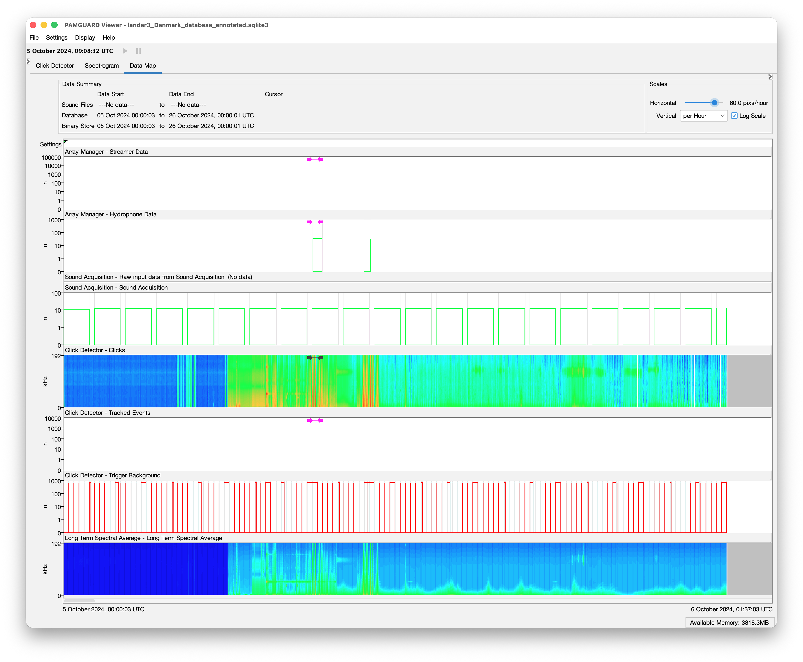
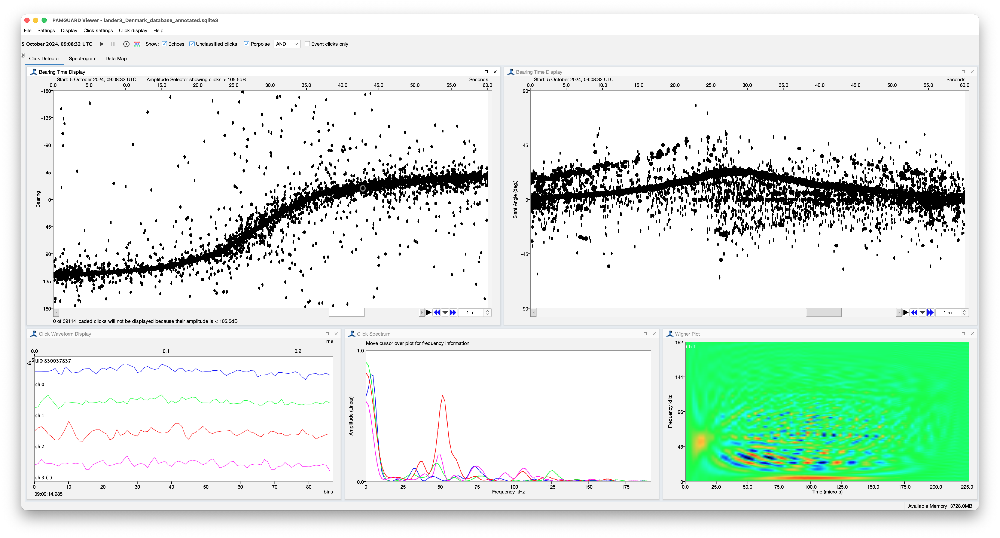
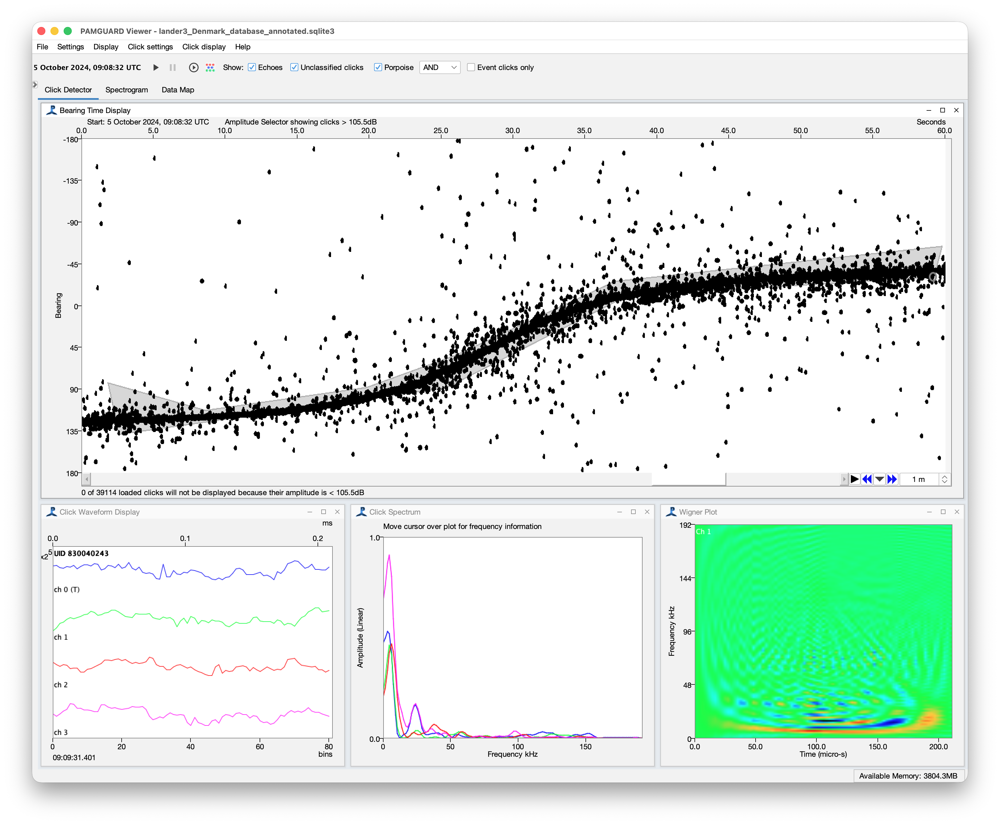
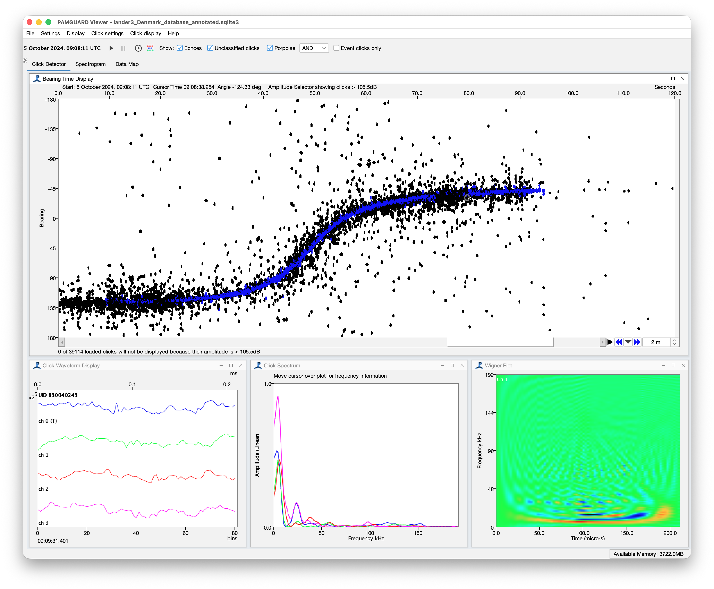
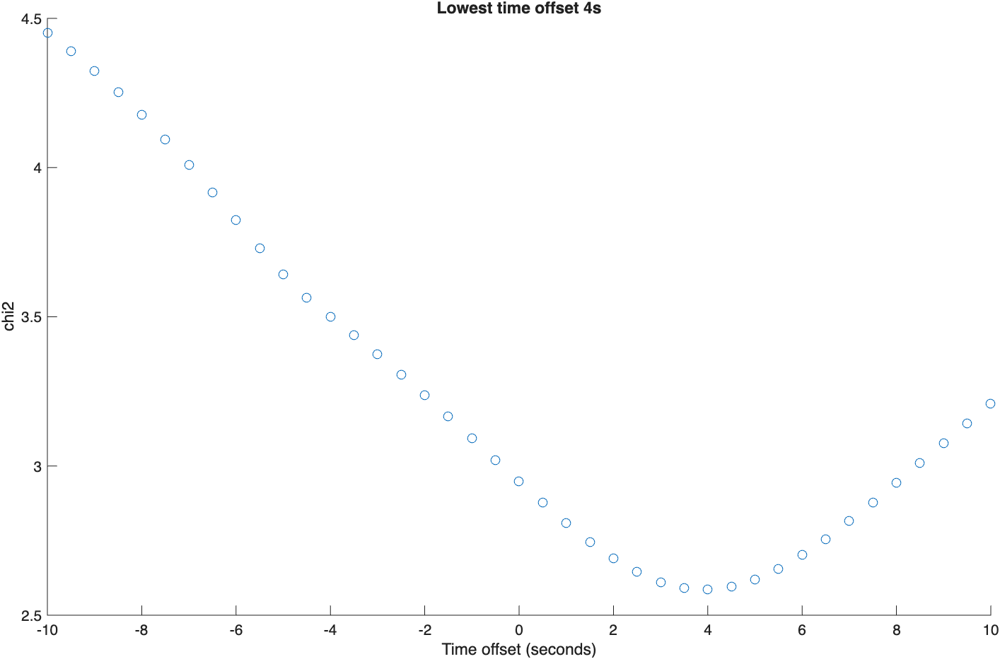
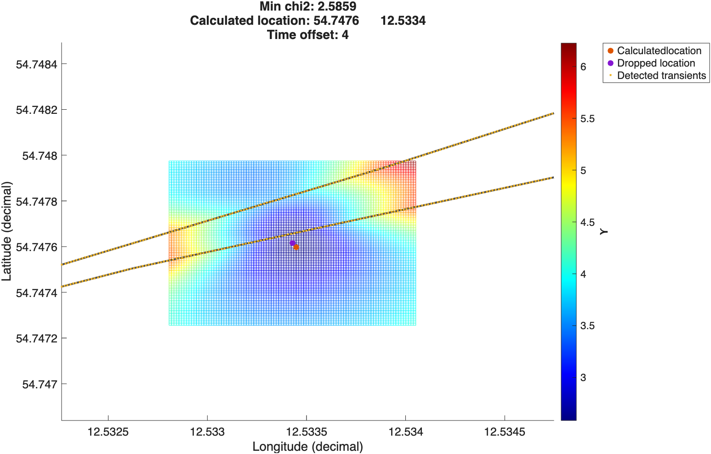
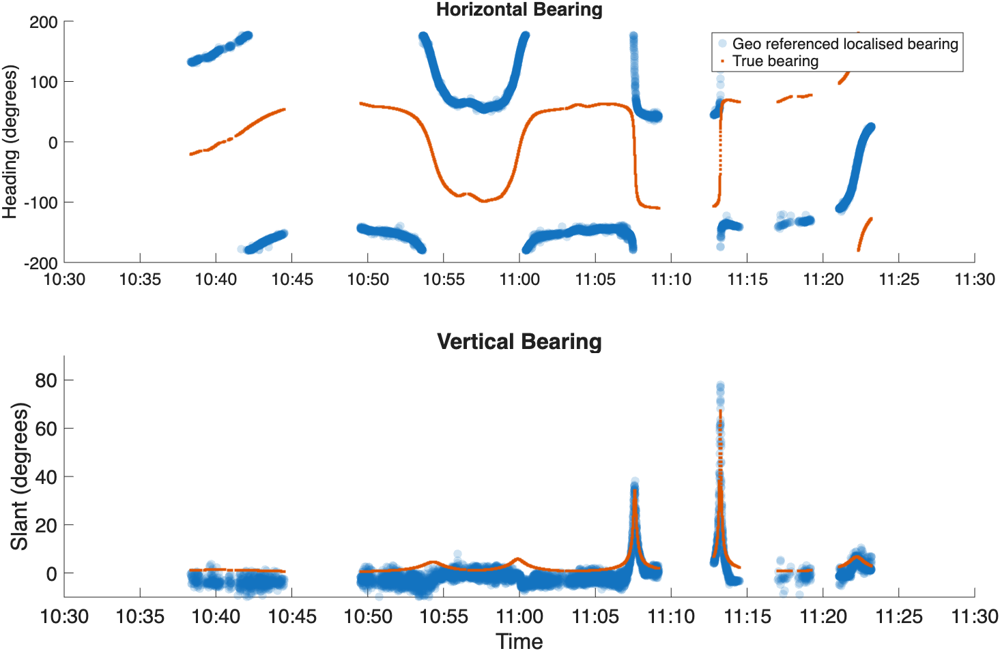
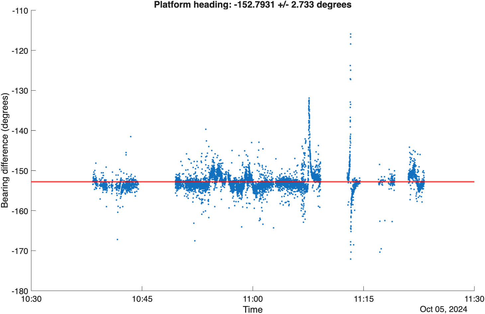
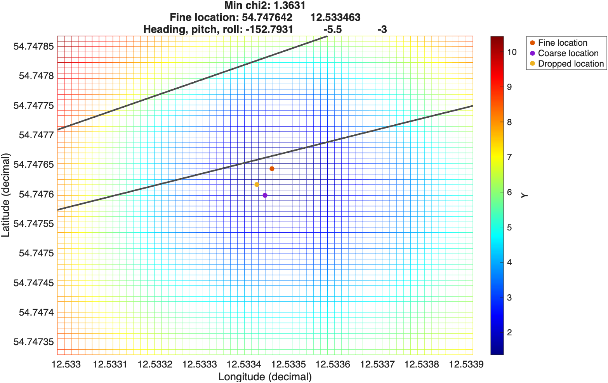
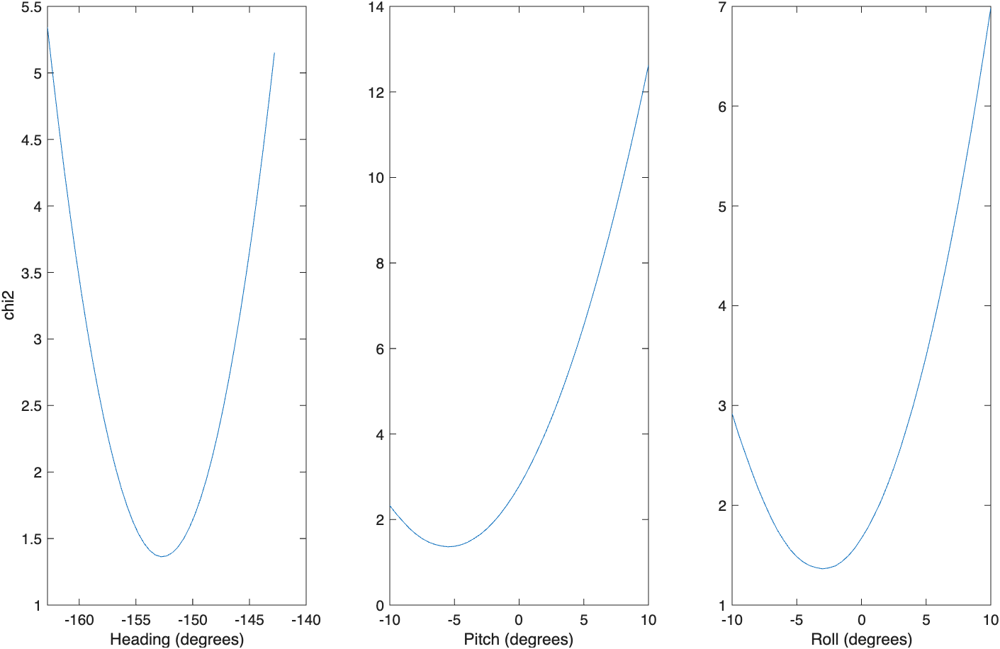

::: {.callout-note appearance="simple"}
|  |  |
|---|---|
| **MATLAB library** | [`cumbiah_landers_mat`](https://github.com/CUMBIAH/cumbiah_landers_mat) |
| **Scripts used** | `locate_platform.m`, `locate_array.m`, `locateplatform.m` |
| **PAMGuard version** | 2.02.18+ (viewer mode) |
| **Event type** | `bc` -- boat cavitation |
| **Worked example** | Lander 1, deployment 1 (Oct 24) |
:::

# Introduction

Each CUMBIAH lander carries a small array of four hydrophones, and that array measures the 3D bearing to any sound it detects. If two or more landers detect the same porpoise click, the bearings can be triangulated and a detected porpoise located. None of that works, though, unless we know two things about every lander to within a metre or two and a degree or two:

1.  **Where it is.** A lander is dropped over the side and falls 17 m through the water column. It does not land where the boat's GPS said it went in -- in deployment 1, Denmark, for example, the landers ended up between 4 m and 20 m from their drop positions.
2.  **Which way it is pointing.** The lander lands at a random orientation on the seabed, so its heading, pitch and roll are unknown (although we assume it's relatively flat). A bearing measured by the hydrophone array is relative to the platform, and until the orientation is known it cannot be turned into a bearing relative to north.

To solve both, the boat ran a set of calibration maneuvers over the landers after each deployment. The propeller cavitation is a loud, broadband transient that every lander detects thousands of times, and the boat's own GPS tells us where each of those transients was made. That gives us a large set of (bearing measured at the lander, known source position) pairs, and from those the position and orientation of the lander can be recovered with a grid search.

This tutorial covers the whole chain:

-   the theory behind the grid search (@sec-theory);
-   marking the cavitation transients as events in PAMGuard viewer mode (@sec-pamguard);
-   checking a single lander with `locate_platform.m` and reading the diagnostic plots (@sec-locate-platform);
-   running `locate_array.m` to locate every lander in a deployment and save the result (@sec-locate-array).

The calculation itself lives in `locateplatform.m`. It plots nothing -- everything the plots need comes back in a `results` struct -- so `locate_platform.m` is the script you actually run, and `locate_array.m` is the same calculation in a loop.

# Pre-requisites


# How the grid search works {#sec-theory}

## What we know and what we are solving for

For every cavitation transient the lander detects, PAMGuard gives us two angles from the time delays between the four hydrophones:

-   a **horizontal bearing**, in the lander's own frame of reference; and
-   a **slant (vertical) angle**, the angle up towards the surface.

PAMGuard geo-references these angles *as if the lander were lying perfectly flat and pointing north*, because at this stage that is the only assumption available. The boat GPS track, interpolated to the time of each click, gives the true position of the source.

That leaves six unknowns per lander:

| Unknown | Notes |
|--------------------|----------------------------------------------------|
| Latitude, longitude | where the lander actually came to rest |
| Heading | rotation about the vertical axis |
| Pitch, roll | how the lander is tilted on the seabed |
| Clock offset | the SoundTrap real time clock against the boat GPS |

Depth is *not* solved for. It is passed in as a known value (17 m for the Danish Great Belt landers) because the slant angle and the depth together are what give range.

::: {.callout-important}
## The clock offset matters more than you would think

The SoundTrap's real time clock is synchronised to GPS on deck before the lander goes in, but it drifts. The boat was moving at a few metres per second during the calibration lines, so a clock offset of a few seconds moves the assumed source position by tens of metres -- comparable to the error we are trying to measure. The offset is therefore fitted alongside the position rather than assumed to be zero.
:::

## What a grid search actually is

If you have not used a grid search before, it is worth a paragraph, because the rest of this page is really just three grid searches in a row.

There is no formula you can feed the bearings into that hands back the lander's position. With six unknowns, thousands of noisy measurements and angles that wrap around at ±180°, working backwards algebraically is a nightmare. So we do not. Instead we solve ther *forward* problem, thousands of times over, and pick the answer that fits best.

The process is this:

1.  **Propose an answer.** Lay an imaginary grid over the seabed -- say every meter across an 80 × 80 m square centered on the drop position -- and take one grid point as a candidate: *suppose the lander is right here*.
2.  **Predict what we should have seen.** If the lander really were at that point, then for every cavitation transient we know exactly what angle it *should* have measured, because we know where the boat was from its GPS.
3.  **Score the answer.** Compare those predicted angles with the angles the lander actually measured. The closer they match across all the clicks, the better this candidate position is. That score is the chi-squared (@sec-chi2).
4.  **Repeat for every grid point** and keep the one with the best score.

It is brute force, and unashamedly so. It can also be scaled up dimesniosinally, so instead of each grid point being a laititude, longitdue, it can be 5D grid of latitude,longitude,heading, pitch and roll. The appeal of this approach is that it is relatively simple: you only need to be able to predict the measurement for a given answer, which is straightforward geometry, and a normal consumer computer easily has the processor power to try tens of thousands of answers.

::: {.callout-tip}
## The surface is worth more than the answer

Because every grid point gets a score, the output is not a single position -- it is a whole **surface** of scores, and that surface is an important way to diagnose whether the caclutated location is true. Plot it (as in @fig-coarse-grid and @fig-fine-grid) and you can see at a glance whether the solution is likely valid.

-   A **deep, narrow bowl** with the minimum in the middle means the data pin the lander down tightly. Move a few metres in any direction and the fit gets noticeably worse.
-   A **broad, flat basin** means many positions fit the data almost equally well. The "best" point is then barely better than its neighbours, and you should not believe it to the metre.
-   **Two separate bowls**, or a minimum pressed against the edge of the grid, means something is wrong -- usually that the true answer is outside the grid, or that the calibration events include something that is not cavitation.
:::

The one real cost is that the work grows with the number of grid points multiplied by the number of clicks. That is why the search is done coarse-then-fine (@sec-passes) rather than at 1 m resolution over the whole sea area, and why the bearings are thinned first.

## The chi-squared {#sec-chi2}

Every candidate solution is scored with a chi-squared: for each click, take the difference between the angle the lander measured and the angle you would expect if the lander really were at that candidate position and orientation, square it, and divide by the assumed measurement error. The bearing error is taken as 5° and the slant error as 3°. The chi-squared is summed over all clicks and divided by the number of clicks, so it is a *mean* per-click value and comparable between landers with different numbers of calibration clicks.

A chi2 of 1 means the residuals are about the size of the assumed errors -- which is as good as it gets. Values of 1--3 are a good fit; a chi2 in the tens means something is wrong.

::: {.callout-tip}
## Bearings are thinned before the search

Propeller cavitation produces an enormous number of transient detections, and, as noted above, the processing power required scales with grid points × clicks. `locateplatform` therefore keeps at most `maxbearings` bearings per second (default 5), spread evenly through each second, which is plenty to constrain six parameters and keeps the search to minutes rather than hours.
:::

## Three passes {#sec-passes}

`locateplatform` does not search all six parameters at once -- that grid would be far too large. Instead it runs three passes, each one narrowing the problem for the next.

### Pass 1: coarse position, repeated over clock offsets

A grid of candidate positions is laid out around the drop position (or over the whole boat track if you do not constrain it) and the chi2 is evaluated at every grid point. The whole grid search is then repeated for each clock offset in `rtcoffset` (default −10 to +10 s in 0.5 s steps), and the offset that produces the lowest chi2 anywhere on its grid is taken as the true one.

::: {.callout-note}
## Why the coarse pass uses only the slant angle

The default `searchtype` is `'slant'`, so the coarse pass ignores the horizontal bearings entirely. This is deliberate: at this stage the heading is unknown, and an unknown heading rotates every horizontal bearing by the same unknown amount, making them useless for fixing position. The slant angle, on the other hand, is unaffected by heading (for a roughly level lander) and, combined with the known depth, gives the horizontal range to the boat. Range circles from boat positions all around the lander intersect at one point -- which is exactly what the coarse grid search finds.
:::

### Pass 2: heading

Now that we have a position, the true horizontal bearing from the lander to the boat can be calculated for every click. The measured bearings were geo-referenced assuming the lander points north, so **the difference between the measured and the true bearing is the heading**.

The heading is taken as the *circular* mean of that difference, so that the wrap-around at ±180° does not bias it, and the circular standard deviation of the same quantity is reported as a measure of how well it fits.

### Pass 3: fine search over position and orientation together

The last pass searches position, heading, pitch and roll simultaneously: a 1 m grid over ±30 m around the coarse position, crossed with heading, pitch and roll in 0.5° steps over ±10° (heading centred on the value from pass 2). This pass uses **both** the horizontal and slant angles, because now that the heading is being searched the horizontal bearings are informative again.

::: {.callout-warning}
## Why the heading is re-searched rather than applied

The fine search uses the *raw* bearings and searches the heading around the pass 2 value, rather than pre-rotating the bearings by that heading and looking for pitch and roll on top. Heading, pitch and roll are a single rotation applied in that order; rotating by the heading first and then fitting a pitch and roll to the result would not give the true pitch and roll of the lander.
:::

# Marking cavitation transients in PAMGuard {#sec-pamguard}

Before any of the above can run, the calibration transients have to be marked up as events in PAMGuard viewer mode and saved to the database. `locateplatform` reads them back out by event type, so this step is a prerequisite, not an optional extra.

This section assumes you have already built and run a PAMGuard configuration for the lander as described in [Tracking Porpoises with PAMGuard](pamguard.qmd) -- the click detector, the SoundTrap SWV sensor import, the database and the binary store all need to be in place, and the data must have been processed.

::: {.callout-note}
## Cavitation is detected by the porpoise click detector

The click detector is configured with an 80--150 kHz trigger band to pick out porpoise clicks, but propeller cavitation is broadband and easily loud enough to trigger in that band as well. You do not need a separate detector or a reprocessing run -- the transients are already in the binary store.
:::

## Finding the calibration period

The calibration lines were always run soon after the landers were deployed, so the transients are in the first hour or so of each deployment. Open PAMGuard in **viewer mode** and select the database and binary store for a lander. Go to the ***Data Map*** tab and navigate to the start of the deployment. The calibration shows up as as a series of broadband click events.

Right click on that block and select ***Centre Data Here*** to load it.

{#fig-mark-datamap}

## Identifying the transients

Switch to the ***Click Detector*** tab and look at the bearing-time display. The cavitation transients are unmistakable: a thick, continuous band of detections whose bearing sweeps smoothly as the boat drives past, rather than the short, sparse click trains of a porpoise. Most will be unclassified (black) because they are not porpoise-like, so make sure ***Unclassified clicks*** is ticked at the top of the display or you will not see them at all. 

::: {.callout-note}
In fact, it's good these clicks are not porpoise like because their braodband nature means they produce very accurate time delays and so therefore accruate bearings 
:::

Set the loaded duration to something generous (30 minutes) using the navigation dialog so that a whole calibration line is visible at once.

{#fig-mark-transients}

## Marking them up

Use the area selection tool exactly as for a porpoise click train: double click on the bearing--time display, draw a polygon around the transients, and join the ends of the dotted line so the selected area goes grey (you can also just draw a box). Then right click inside the grey area and select ***Label Clicks*** (or press *Ctrl+L*). Do this for in the bearing time display and then move to the slant angle display (right click) - remove clicks which are not part of the smooth bearing change - we only want to reduce false bearings if possible. 

{#fig-mark-area}

In the event dialog, create a new event and set the ***Event type/species*** to **`bc`** (boat cavitation). If `bc` is not in the list yet, click the cog icon next to the selection box and add it in the Lookup Editor. This label is what `locateplatform` searches for, via its `eventtype` option, so it must match.

{#fig-mark-event width="350"}

Once and event is marked out it should look something like this.

{#fig-mark-transients-event}

Note that this is just one section of a calibration trial. As many of the passes as possible should be marked out and all the marked clicks should be a 'bc' event type. 


::: {.callout-tip}
## What to include and what to leave out

-   **Cover the whole calibration, not just the best line.** The grid search is constrained by the boat approaching the lander from a range of directions, so bearings from all the lines together are worth far more than a lot of bearings from one line.
-   **Include the overhead passes.** They look messy -- the slant angle swings through its full range in a few seconds -- but they are the most informative clicks in the whole dataset for fixing position.
-   **Do not get too obsessed with whether individual clicks should be removed or added** The search is a least-squares fit over thousands of bearings, so a scattering of echoes and bad time delays is averaged out. Taking ages to agonise over each clicks is not worth the effort.
-   **Several events are fine.** `locateplatform` pools every `bc` event in the day folder, so one huge event or mutliple events per pass are fine. 
:::

Once the events are saved, the annotated database (`lander<N>_<Site>_database_annotated.sqlite3`, e.g. `lander1_Denmark_database_annotated.sqlite3`) holds the calibration events and the binary store holds the clicks themselves. That is everything the MATLAB side needs.

# Checking one lander: `locate_platform.m` {#sec-locate-platform}

## Prerequisites

The MATLAB side needs rather more on the path than the `cumbiah_landers_mat` repository alone.

| Requirement | What it is needed for |
|--------------------|----------------------------------------------------|
| [`cumbiah_landers_mat`](https://github.com/CUMBIAH/cumbiah_landers_mat) | The library itself: `locateplatform`, `getlanderdeploymentinfo`, `getlanderpaths` and the per-country functions behind them, `getlandersuperfolder` |
| [PAMGuardMatlab](https://github.com/PAMGuard/PAMGuardMatlab) | The `pgmatlab` package, used to read the click waveforms and bearings out of the PAMGuard binary store |
| [soundnetloc_mat](https://github.com/Sound-Net/soundnetloc_mat) | `grdsrch_pos`, `grdsrch_pos_hpr`, `st_loc_chi2`, `interpsrcloc`, `plot_chi2_surf`, `plot_clk_src_bearings` -- the grid search and its plotting helpers, `latLong2meters`, `latLong2bearing`, `getsuperfolder`, `getdefaultcols` |
| MATLAB **Database Toolbox** | `sqlite`, used to read the `bc` events out of the PAMGuard database |
| MATLAB **Mapping Toolbox** | `readgeoraster`, `mapcrop`, `projfwd` -- only needed by `locate_array.m` for the bathymetry |

## Data management

The main script takes a struct of data paths - it needs to know where your PAMGuard database, binary file store, GPS data is along with metadata like drop location. Because we have up to nine landers per country, it is a good idea to create some datamanagement functions. Instead of hard coding a struct each time, you input a country, a lander and a deployment, and a function works out where everything is and what dtaa paths are needed. The management functions should be roughly the same in every country: one folder per country, a settings spreadsheet describing every deployment, one folder per lander holding its PAMGuard output, and a pair of MATLAB functions that know how to read them. The examples below use the Danish array (nine landers in the Great Belt, three deployments), because Denmark is the only country implemented so far. Germany and Sweden have placeholder functions waiting to be filled in -- see @sec-One-folder-per-country.

### How a lander is looked up

Two functions are called from the scripts, and each one passes the work on to a function for the right country:

| Function | What it does | How it finds the country |
|--------------------|---------------------------|---------------------------|
| `getlanderdeploymentinfo(lander, deployment, country)` | Turns a lander number and a deployment number into a start time, an end time, a SoundTrap serial and the hydrophone IDs | The `country` input. A `switch` sends `'Denmark'`, `'Germany'` or `'Sweden'` to `getdanishlanderdeploymentinfo`, `getgermanlanderdeploymentinfo` or `getswedishlanderdeploymentinfo` |
| `getlanderpaths(serial, time)` | Turns a serial and a time into the full `data` struct, including every file path | It doesn't need telling. It tries `getdanishlanderpaths`, `getgermanlanderpaths` and `getswedishlanderpaths` in turn and takes the first one that recognises the SoundTrap |

The two work differently because of what identifies a lander. **Lander and deployment numbers are only unique within a country** -- German lander 1 is a different instrument from Danish lander 1 -- so `getlanderdeploymentinfo` has to be told the country. **SoundTrap serial numbers are unique across the whole project**, so, once you have a serial number, then `getlanderpaths` can search every country for it. In a script this means the country is set once, at the top:

``` matlab
country      = 'Denmark';
landernumber = 1;
deployment   = 1;

[startTime, ~, serialnumber] = getlanderdeploymentinfo(landernumber, deployment, country);
data = getlanderpaths(serialnumber, startTime);
```

The search in `getlanderpaths` relies on one rule: a country's `get*landerpaths` function must return `cumbiahdatadefaults()` (a struct with an empty `landernumber`) for a SoundTrap it does not know, rather than raising an error. That is how `getlanderpaths` knows to move on to the next country. If no country recognises the SoundTrap, `getlanderpaths` returns the same empty struct, so check `isempty(data.landernumber)`.


### One folder per country

Each country needs to populate it's own data management function which points to the pamgaurd database, binary file folder and metadata. From here we will take the Danish deployements  as an example.The Danish folder structure is. 

Inside a country folder, the Danish layout is:

```
Denmark/
    Lander settings <revision>.xlsx
    GPS/
        denmark_deployment<D>_gps.mat                    <- data.gpsfile
    lander<N>/
        lander<N>_Denmark_database_annotated.sqlite3     <- data.sqlitedB
        pamguard/
            lander<N>_Denmark_database.sqlite3           <- data.rawsqlitedB
            Lander<N>_Denmark.psfx                       <- data.psfxfile
            PAMBinary/                                   <- data.binaryfolder
            PAMBinary_sud_sensor/                        <- data.sensorbinaryfolder
```

The data is organised **by lander, not by deployment**. A lander keeps the same SoundTrap for the whole project, and every deployment of it is processed into one PAMGuard database and one binary store. So `data.sqlitedB` and `data.binaryfolder` are the same for every deployment of a given lander; only the times and positions change. 

Behind the Danish functions sit three helpers:

| Function | What it does |
|--------------------|----------------------------------------------------|
| `getlandersuperfolder(country)` | Returns the country's folder: the Dropbox root from `getsuperfolder` (soundnetloc_mat), which picks it by the machine's hostname, followed by `2026-27_CUMBIAH/landers/<country>`. Defaults to `'Denmark'` |
| `cumbiahlandertable` | Reads the Danish settings spreadsheet into one entry per (lander, deployment) pair that was actually deployed |
| `cumbiahdatadefaults` | The empty `data` struct: every field a lander record has, set to a neutral default |

These are then used to populate the two crucial data management functions,  `getlanderpaths.m` and `getlanderdeploymentinfo.m`.

`getlanderpaths` needs a time as well as a SoundTrap serial number and then return paths to the data. In `getdanishlanderpaths` the paths are written out lander by lander in the local function.  `getlanderpaths` then iterates through all the different countries  `get*landerpaths` functions returning the correct values - this means other functions need minimal code changes. 

`getlanderdeploymentinfo.m` returns a SoundTrap serial number and a deployment time for a given deployment number, lander ID and country flag. For example, deployment `1`, lander `1` and country `'Denmark'` would return the serial number of the SoundTrap and deployment time for lander 1 in the first Danish deployment. These feed into `getlanderpaths`. Essentially, this function makes it easier for a user to identify serial numbers and deployment times. Again each country is responsible for populating their own  `get*landerdeploymentinfo.m` function. In `getdanishlanderdeploymentinfo` for an example,  `cumbiahlandertable` reads the required metadata from a spreadsheet, however, it can just as easily be hard coded into the function if needed. 


### Data format

The `data` struct returned by `getlanderpaths` should have the format below. Whatever country a lander comes from, its `get*landerpaths` function must return a struct with every one of these fields to be compatible with the rest of the library. `cumbiahdatadefaults()` gives the empty version: start from it and fill in what you have. A field you cannot fill keeps its default rather than being left out.

**What and when**

| Field | Type | Contents |
|--------------------|------------|----------------------------------------------|
| `landernumber` | double | The lander number, as that country numbers its landers. Empty means "no lander found" -- see above |
| `deployment` | double | The deployment number within that country, e.g. for Denmark 1 = Oct 24, 2 = Feb 25, 3 = June 25 |
| `serialnumber` | double | The SoundTrap ST640 ID, e.g. `8690`. Unique across the whole project |
| `startTime` | datetime | When the lander went in the water |
| `endTime` | datetime | When it was recovered. The deployment is the half-open window `[startTime, endTime)` |
| `synctime` | datetime | When the SoundTrap clock was synchronised to GPS on deck |

**Where**

| Field | Type | Contents |
|--------------------|------------|----------------------------------------------|
| `droplocation` | 1×2 double | `[lat lon]` where the lander was dropped |
| `retrievelocation` | 1×2 double | `[lat lon]` where it was picked up |

Positions are decimal degrees, WGS84, always in the order `[lat lon]`, with longitude **east positive**.

**The instrument**

| Field | Type | Contents |
|--------------------|------------|----------------------------------------------|
| `hydrophoneIDs` | 4×1 double | Hydrophone serial numbers, indexed by SoundTrap channel: `hydrophoneIDs(2)` is the hydrophone on channel 2 |
| `hydrophonecolours` | 4×1 string | Hydrophone colour markings, indexed by channel in the same way |
| `dutycycle` | double | The recording duty cycle |
| `releaser` | double | The acoustic releaser code |
| `cpod` | double | The serial number of the CPOD on the lander |

**Data paths**

| Field | Type | Contents |
|--------------------|------------|----------------------------------------------|
| `sqlitedB` | char | The annotated PAMGuard database -- the one to analyse from |
| `rawsqlitedB` | char | The database as PAMGuard wrote it |
| `binaryfolder` | char | The PAMGuard binary store (clicks and so on) |
| `sensorbinaryfolder` | char | The binary store of the SoundTrap's own sensor data (IMU etc.) |
| `psfxfile` | char | The PAMGuard configuration file |
| `gpsfile` | char | The boat GPS track for this deployment trip |

The paths are full paths, rooted on `getlandersuperfolder(country)`. Nothing checks that they exist: a lander that has not been processed yet returns the paths its data *will* have.

**What the localisation actually uses.** `locateplatform` needs only some of these fields, so they are the ones to get right first when you set up a new country:

-   `landernumber`, which must not be empty;
-   `startTime`, which picks the calibration day;
-   `droplocation`, the centre of the coarse search when you pass `'gridcenter', data.droplocation`;
-   `sqlitedB`, with `rawsqlitedB` as a fallback. If the annotated database has no `bc` events, `locateplatform` warns and reads the calibration events from the raw one instead;
-   `binaryfolder`. This must contain PAMGuard's usual day folders (`yyyyMMdd`), because `locateplatform` reads the clicks from `binaryfolder/<calibration day>`;
-   `gpsfile`, a `.mat` file holding a struct called `gpsdata` with fields `time` (datetime), `latitude` and `longitude` -- the boat track the transients are matched against.

The rest -- hydrophones, releaser, CPOD, sensor data -- is carried along for other analyses.


::: {.callout-important}
### Serial numbers must be unique

`getlanderpaths` takes the first country that recognises a SoundTrap at a given time. If the same serial number were in two countries' spreadsheets with overlapping deployment windows, it would silently return the first one in the list. That cannot happen with SoundTraps - one instrument cannot be in two seas at once -- but it can happen through a typo in a serial number, so check new spreadsheets against the existing ones.
:::

### The` superfolder` function and new machines

`getsuperfolder` provides a root name for the Danish data. You will see it's used in the `getdanishlanderpaths` and `getdanish landerdeploymentinfo.m`. This is a super useful if say using a cloud storage and a root path to the cloud storage folder means it's easy to switch the name of paths on different machines. 

### Checking it worked

However the data got there, finish by checking that a lookup resolves to files that exist:

``` matlab
cumbiahlandertable(true);                         % pick up spreadsheet edits
[t0, ~, sn] = getlanderdeploymentinfo(N, D, 'Denmark');
data = getlanderpaths(sn, t0)
isfile(data.sqlitedB), isfolder(data.binaryfolder), isfile(data.gpsfile)
```

::: {.callout-warning}
### If MATLAB cannot find the data

`getlanderpaths` does not check that any path exists -- a lander that has not been processed yet returns the path its data *will* have. If the localisation fails with a missing-file error, check `data.sqlitedB`, `data.binaryfolder` and `data.gpsfile` against what is actually on disk before looking anywhere else.
:::

## Running the functions

Open `locate_landers/locate_platform.m`, set the country, the lander and the deployment at the top, and run it:

``` matlab
%which country, which lander and which deployment. For Denmark,
%landers 1-9 and deployments 1 = Oct 24, 2 = Feb 25, 3 = June 25
country      = 'Denmark';
landernumber = 1;
deployment   = 1;

[startTime, ~, serialnumber] = getlanderdeploymentinfo(landernumber, deployment, country);
data = getlanderpaths(serialnumber, startTime);

results = locateplatform(data, 'depth', 17, ...
    'gridlims', [-40 40], 'gridcenter', data.droplocation);
```

`getlanderdeploymentinfo` turns the lander and deployment numbers into a start time and a SoundTrap serial number, and `getlanderpaths` turns those into the database, the binary store, the boat GPS track and the drop position. Not every lander was in every deployment -- in Denmark, only landers 1, 5, 7 and 8 were redeployed in Feb 25, and lander 8 never released in June 25 -- and asking for a combination that never happened raises an error listing the deployments that lander *does* have.

The `gridlims`/`gridcenter` pair restricts the coarse search to ±40 m around the drop position. This is worth doing: the alternative is to search the whole boat track, which is correct but much slower.

``` matlab
% search the whole boat track (slow, but makes no assumption
% about where the lander ended up)
results = locateplatform(data, 'depth', 17);
```

::: {.callout-tip}
### Useful options

The full set is in `help locateplatform`; these are the ones you will actually reach for.

| Option | Default | When to change it |
|-----------------|-----------|---------------------------------|
| `depth` | `17` | Different site or a different water depth |
| `gridlims`, `gridcenter` | `[]` | Almost always -- restrict the coarse search around the drop position |
| `rtcoffset` | `-10:0.5:10` | If the chi2-vs-offset curve does not have a minimum inside the range |
| `eventtype` | `'bc'` | If you labelled the calibration events as something else |
| `binaryday` | deployment day | If the calibration was not run on the day the lander went down |
| `searchtype` | `'slant'` | Rarely -- see @sec-theory for why slant is the right choice for the coarse pass |
| `maxbearings` | `5` | Lower to speed up the search, higher for a noisy calibration |
| `setlocation` | `[]` | When the position is known, or the search will not converge -- see @sec-set-location |
:::

### What it prints

The script prints a short summary before it plots anything. For lander 1 of deployment 1:

``` text
Platform heading: -152.7931 +/- 2.733 degrees
Fine location: 54.747642      12.533463 chi2: 1.3631
Platform heading, pitch and roll: -152.7931       -5.5         -3 degrees
Platform  is : 3.7m from drop location
Platform  is : <distance>m from retrive location
```

Read it in this order:

1.  **The heading standard deviation.** A few degrees is normal. If it is 20° or more, the coarse position is probably wrong and everything after it is meaningless.
2.  **The fine chi2.** 1--3 is a good fit. Much more than that and the lander is not where the search thinks it is.
3.  **The distance from the drop and retrieve positions.** These are an independent sanity check that costs nothing. A few metres is expected. Twenty metres is possible for a lander dropped in a strong tide -- lander 3 in deployment 1 moved 19.6 m -- but two hundred metres means the search has found the wrong minimum.

## Reading the plots

The script then draws seven figures, and each one checks a different part of the calculation. They open as MATLAB figure windows 3 to 9 -- those are the numbers used in the headings below, so that they match the script; the figure numbers in this page's captions are separate.

### MATLAB figure 3 -- chi2 against clock offset

{#fig-rtc}

**What you want to see:** a clean, smooth, U-shaped curve with a single minimum comfortably inside the search range. In @fig-rtc the minimum is at +4 s, which is a plausible amount of drift for a SoundTrap over a few hours.

**What to worry about:** a minimum sitting at one end of the range means the true offset is outside it -- widen `rtcoffset` and run again. A flat curve means the boat was not moving enough for the offset to matter (or the GPS track is wrong). A curve with several minima usually means the calibration events include something that is not cavitation.

### MATLAB figure 4 -- the coarse chi2 surface

{#fig-coarse-grid}

This is the slant-angle-only position search from pass 1, plotted over the ±40 m grid. The dotted orange lines are the positions of the detected transients -- in other words the boat track, which here consists of two passes running roughly east--west either side of the lander.

**What you want to see:** a single, well-defined blue minimum, with the calculated position (orange) and the drop position (purple) close together. The chi2 should rise clearly in every direction away from it.

**What to worry about:** a broad flat blue region, or a minimum that runs off the edge of the grid, means the geometry does not constrain the position. This normally happens when the boat only approached from one direction -- the range circles are all nearly parallel and never cross cleanly. If that is the case, the honest fix is more calibration lines, and the practical fix is `setlocation` (@sec-set-location).

This figure is skipped entirely when `setlocation` is used, since there is no coarse search to plot.

### MATLAB figure 5 -- measured against true bearings, before correction

{#fig-coarse-bearings}

The top panel is the horizontal bearing and the bottom panel the slant angle, both against time.

**What you want to see:** in the horizontal panel, the blue and orange traces have the *same shape* but are displaced vertically (and wrap around at ±180°, which is why the blue trace appears in two pieces). That constant displacement is the heading, and the fact that the shapes match is what tells you the position is right. In the slant panel the two should already overlay well, because the slant angle is what the coarse search fitted -- note the two sharp spikes where the boat passed directly overhead.

**What to worry about:** if the *shapes* differ in the horizontal panel, no heading will ever reconcile them and the position is wrong.

### MATLAB figure 6 -- bearing difference over time

{#fig-heading-diff}

This is @fig-coarse-bearings reduced to a single number per click: measured minus true horizontal bearing. The red line is the circular mean, which is the heading.

**What you want to see:** a flat band of points centred on the red line, a few degrees wide. Here the heading is −152.79° with a circular standard deviation of 2.73°.

**What to worry about:** a *trend* in the points over time means the lander moved during the calibration -- worth cross-checking against the SoundTrap's own magnetometer heading. Structure that repeats with the boat passes (the excursions around 11:07 and 11:13 above are the overhead passes, where the horizontal bearing is genuinely ill-defined) is expected and harmless. A band 20° wide is not.

### MATLAB figure 7 -- the fine chi2 surface

{#fig-fine-grid}

This is the same kind of plot as @fig-coarse-grid but at 1 m resolution and using both the horizontal and slant angles, so the minimum is much better defined -- note that the chi2 has dropped from 2.59 to 1.36 by letting the orientation move.

**What you want to see:** a tight bowl with the fine location in the bottom of it, and all three markers within a few metres of each other.

**What to worry about:** a fine location pinned to the edge of the ±30 m grid means the coarse position was off by more than the fine search can recover; either widen `finegridlims` or fix the coarse search first.

### MATLAB figure 8 -- chi2 against heading, pitch and roll

{#fig-fine-chi2}

Each panel takes one angle and shows the lowest chi2 achievable at each value of it, minimised over everything else.

**What you want to see:** three clean parabolas with well-defined minima. Here they land at −152.5° heading, −5.5° pitch and −3° roll, i.e. a lander sitting a few degrees off level -- entirely reasonable for a frame on a soft seabed.

**What to worry about:** a minimum at the edge of the ±10° range, which means the lander is more tilted than the search allows -- increase `fineanglelims`. A very flat curve means that angle is not constrained by the data; for pitch and roll this happens when the boat never passed close enough overhead to give a range of slant angles.

### MATLAB figure 9 -- corrected bearings against true bearings

{#fig-fine-bearings}

**This is the figure to judge a localisation on.** It is @fig-coarse-bearings redrawn with the answer applied, so the constant offset in the horizontal panel should have vanished and the blue points should sit on top of the orange line throughout -- including through the sweeps as the boat passes and the spikes in the slant panel where it goes overhead.

**What you want to see:** blue on orange everywhere, with scatter of a few degrees.

**What to worry about:** any systematic departure -- a section of the record where blue and orange separate, or a residual that grows through the calibration. Both mean the six-parameter model has not captured something, most often because the lander moved.

Work through the landers one at a time with this script, and only move on to the array once every lander gives a convincing @fig-fine-bearings.

## When a lander will not converge {#sec-set-location}

Some landers do not give a clean minimum -- usually because the boat only ran one line past them, or the calibration was cut short. For these, the position can be forced and only the clock offset and the orientation fitted:

``` matlab
% the lander position is known (or taken from the drop position) -
% fit only the clock offset and the heading, pitch and roll
results = locateplatform(data, 'depth', 17, ...
    'setlocation', [54.7478397, 12.5337717]);
```

The coarse position search is skipped, so @fig-coarse-grid is not drawn, but every other figure still applies -- and @fig-fine-bearings will tell you soon enough whether the forced position is defensible.

# Locating the array: `locate_array.m` {#sec-locate-array}

Once each lander has been checked individually, `locate_array.m` runs the same calculation for every lander in a deployment, plots them together over the seabed, and saves the positions and orientations for use downstream.

## Setting it up

The options are all at the top of the script:

``` matlab
%which country, which deployment and which landers. For Denmark,
%1 = Oct 24, 2 = Feb 25, 3 = June 25
country    = 'Denmark';
deployment = 1;
landers    = [1 2 3];

depth      = 17;      % lander depth (m), passed to LOCATEPLATFORM

boxsize    = 1000;    % bathymetry kept around the landers (m)
zexag      = 100;     % vertical exaggeration of the seabed
plotradius = 300;     % plot +/- this many m around the landers
plotgps    = false;   % draw the boat GPS track

recalculate    = true;   % force the localisation to run again
reextractbathy = false;  % force the bathymetry to be cut from the grid again
```

`zexag` deserves a comment: the seabed here changes by around a metre per kilometre, so without a vertical exaggeration of about ×100 the bathymetry is indistinguishable from a flat plane.

## What gets saved

The localisation is slow -- minutes per lander -- so the results are cached:

| File | Contents |
|--------------------|----------------------------------------------------|
| `lander_array_locations_dep<N>.mat` | `locstable`, one row per lander, in the lander super folder |
| `bathymetry/lander_array_bathymetry_dep<N>.mat` | The bathymetry square cut out around the landers |

`locstable` holds `landernumber`, `location`, `locationfine`, `hprfinal`, `headingoffset`, `headingstd`, `rtctimeoffset`, `chi2` and `chi2fine` for each lander. It is reloaded on the next run unless `recalculate` is `true`, or the lander list or depth have changed.

::: {.callout-important}
## The full results are not saved

The complete `locateplatform` output for each lander -- including the chi2 surfaces, which can run to gigabytes -- stays in the workspace as the cell array `results` and is deliberately not written to disk. If you want to re-examine a surface, you need it from the run that produced it, or you re-run that lander in `locate_platform.m`.
:::

The bathymetry is cut out of the Danish KattegatSouth 50 m depth model once and then reused. It can be loaded on its own, without the full grid or the Mapping Toolbox:

``` matlab
load(bathyfile, 'bathy')
```

`bathy.depth` is in metres, negative down, on cell centres given both as UTM 32N (`bathy.easting`, `bathy.northing`) and as `bathy.lat` / `bathy.lon`. `bathy.R` is the map raster reference.

## Reading the output

The script prints one line per lander:

``` text
Lander 1: drop 54.7476236 12.5334372  calculated 54.7476418 12.5334630  heading, pitch, roll -152.7931  -5.5  -3
```

and then draws the array over the seabed.

{#fig-array}

The legend is informative; for each lander it gives the distance between the drop and the calculated position, and for each *pair* of landers it gives the separation between their calculated positions. Those inter-lander distances are what the porpoise triangulation depends on, and they are worth checking against the nominal array design -- the landers were laid out as roughly 30 m triangles.

In @fig-array, landers 1 and 2 landed within a few metres of where they were dropped, while lander 3 moved 19.6 m north. That is a real displacement, not an artefact: it is exactly the sort of thing this whole exercise exists to measure, and using the drop positions instead would have put every bearing from lander 3 nearly 20 m out.

Set `plotgps = true` to drape the boat's GPS track over the seabed as well, which is a quick way of seeing what geometry each lander's calibration actually had.

## Forcing a position

If a lander needs `setlocation`, swap the `locateplatform` call inside the loop for the forced form:

``` matlab
for i = 1:nlander
    results{i} = locateplatform(data(i), 'depth', depth, ...
        'setlocation', setloc);
    ...
end
```

The calculated position plotted for that lander is then the one you set, with only the clock offset and orientation fitted around it.

# Next steps

With every lander in a deployment located and oriented, the bearings from each cluster can be geo-referenced properly and matched clicks triangulated between landers. That is covered in [Localise Porpoises](localiseporpoises.qmd).
