::: {.callout-note appearance="simple"}
| | |
|---|---|
| **Dataset DOI** | -- |
| **Last tested** | 11/05/2026 |
| **PAMGuard version** | 2.02.18+ |
| **Data folder** | `lander1/data` |
:::

# Introduction

Baltic harbour porpoises are a protected subspecies under threat from habitat degradation and bycatch in static fishing nets. Monitoring their distribution and abundance is crucial for guiding conservation and regulatory efforts. Porpoises are usually undemonstrative animals, and the Baltic is a large area, much of which has a very low density of porpoises. The strategy for abundance estimation has therefore been to use passive acoustic monitoring; specifically, the use of long-term autonomous recorders distributed across the entire Baltic and monitoring for a year.

Estimating porpoise density from PAM devices requires an estimation of the probability of detection, *P*\*[^pstar]. This involves calculating how many clicks or porpoise-positive seconds might be missed over a monitored area. However, estimating P is not straightforward and with static PAM devices like CPODs an external experiment is usually required. These experiments vary widely, such as using a theodolite to track porpoises around a CPOD, drones and aerial surveys or, as in this case, an array of hydrophones for acoustically tracking porpoises.

In this tutorial, we will use PAMGuard to determine positional information of harbour porpoises from compact clusters of hydrophones deployed to track porpoises around a garden of CPODs. The hydrophone clusters are arranged in 30 m triangles -- forming a tracking array. As a porpoise approaches the tracking array, each cluster provides a bearing to detected clicks. Where the bearings cross is the position of the porpoise. As porpoises click regularly, the tracking array can build up a 3D geo-referenced track of a porpoise. Comparing the distance of the track to whether the porpoise was detected on the CPODs next to the array allows for an estimation of the probability of detection. This then provides a crucial piece of the puzzle for abundance estimation from the CPODs deployed across the Baltic.

The aim of this tutorial is to process data from the hydrophone clusters, identify harbour porpoise encounters, extract geo-referenced bearings to porpoise clicks, and export the data to R and MATLAB for further analysis.

[^pstar]: *P* is required for distance sampling methods. SECR is another potential method that requires multiple devices to be ensonified by a porpoise. It also, essentially, creates a probability of detection; however, this is more integrated within the SECR framework rather than an external parameter.

# Detecting porpoises from raw sound files

Before we can localise the position of porpoises we first have to detect and classify their tell-tale narrow band high frequency (NBHF) clicks. PAMGuard has a comprehensive click detection and classification module that can be used for this. In this first section we will run the click detector on raw acoustic data, extract clicks and classify to porpoise.

First make sure that the latest version or the version of PAMGuard this tutorial was last tested on is installed. Open PAMGuard (Normal mode). When prompted, create a new. psfx settings file. Name it and save it somewhere sensible You will be presented with a blank canvas.

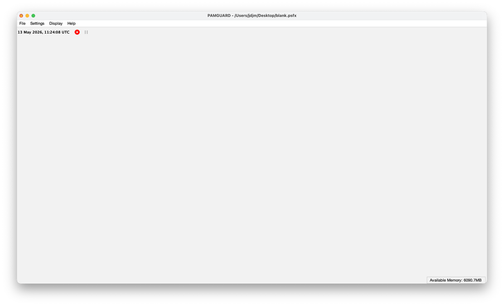{#fig-1}


PAMGuard is a modular program. i.e. you must tell it what you want it to do, and what algorithms you want run by adding specific modules for each signal processing/detection task. Once this has been completed the module configuration is saved in the settings file and can then be reopened without having to set anything up again i.e. the process of constructing the workflow only needs to happen once.

The first module we need is a something which acquires the acoustic data from the recording device or sound files. Click ***File → Add Modules → Sound Processing → Sound Acquisition**.*

The sound acquisition module will now have been added. Click ***Settings → Sound* *Acquisition*.** In the drop down. In the ***Data Source Type*** drop down menu select ***Audio file folder or multiple files*.** Now click ***Select Folder or Files*** and browse to the folder (named ***audio***) containing sud files from the 4 channel SoundTraps

*Note: Sud files contain metadata, detection data, orientation data and compressed audio from SoundTraps. SoundTrap host software can decompress sud files however this can increase the size of the dataset by up to four times. PAMGuard can now read sud files directly which means, in many cases, there is no need to decompress them, saving time and a lot of hard disk space!*

The peak-to-peak voltage range of a SoundTrap is 2V. Enter this in the ***Peak-to-Peak*** voltage range box to make sure PAMGuard calibrates acoustic measurements properly i.e. to ensure that received amplitudes in dB are correct. Click OK.

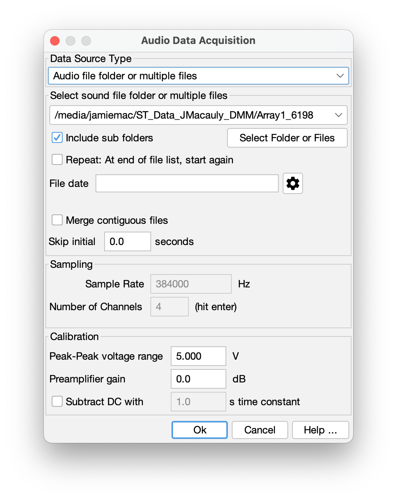{#fig-2 width="450"}


Now that the Sound Acquisition module is added PAMGuard knows the sample rate and number of channels of the data to be processed. This will make setting up the next modules easier by ensuring that PAMGuard initially uses sensible default values for each new module. Note that if the sample rate or channels are incorrect something has gone wrong.

You may receive a warning that PAMGuard needs to open the array manager because the number of channels does not match the number of hydrophones. Click ***Ok*** to open the array manager window. Select Import... and import the ***lander1_Denmark_array.paf*** file in the data folder -- this contains the hydrophone positions for the array. You may wish to enter some information on the device ***Instrument Type*** and ***Instrument Id*** (e.g. SoundTrap serial number) and then Click ***Ok*** to save and close the array manager.

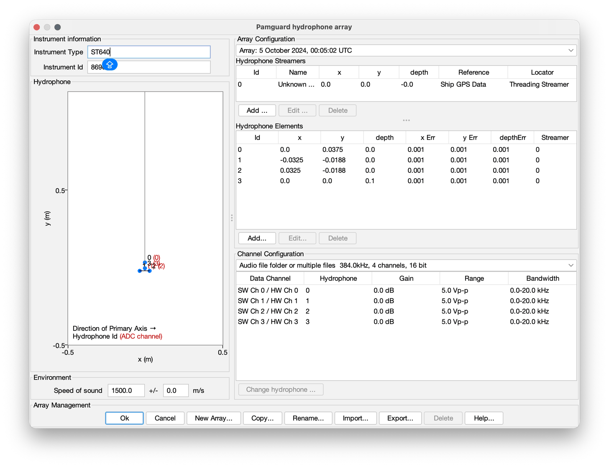{#fig-3}


On that note, opening the project information window ***Settings → Project Information*** and filling out some basic metadata on what you are doing is good practice and saves headaches when revisiting datasets.

Many of the detector or soundscape modules in PAMGuard require Fast Fourier Transform (FFT) data -- in this example we will be using an FTT module as an input for a long term spectral average (LTSA). Click ***File → Add Modules → Sound Processing → FFT (Spectrogram Engine)***. Open the module settings by selecting ***Settings → ** **FFT (Spectrogram Engine) settings...***

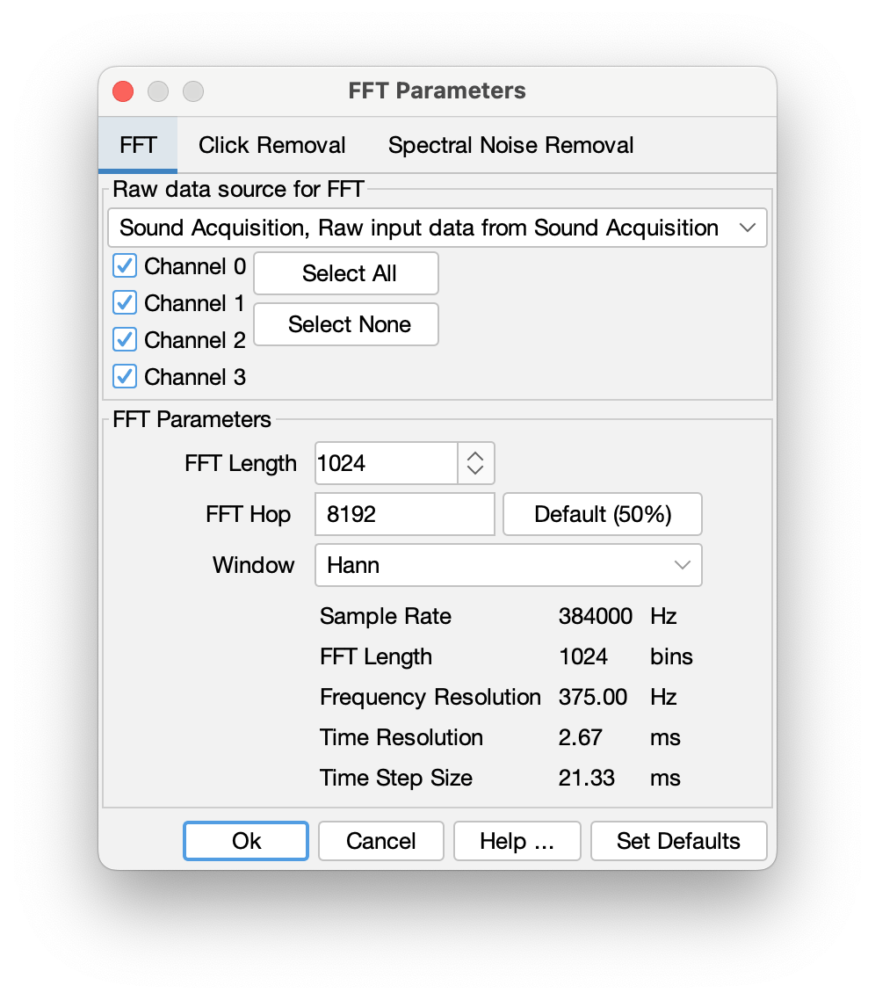{#fig-4 width="470"}


Make sure all 4 channels are selected an increase the hop size to 8192 samples. In this configuration the FFT is only used for visualisation purposes and not as an input into an analysis algorithms. A larger hop size reduces processing requirements and so speeds up data analysis, especially for multi-channel high frequency data such as this.

Viewing the FFT data requires a display. To create a spectrogram display, first add a display tab - Click ***File → Add Modules → Displays → User Displays*.** You will see that a new display tab has been added but the contents are empty. Click ***User Display → New Spectrogram Display*.** A dialog box will appear. Make sure the ***Number of Panels*** is 4, click ***One panel per channel*** and hit ***Ok***.

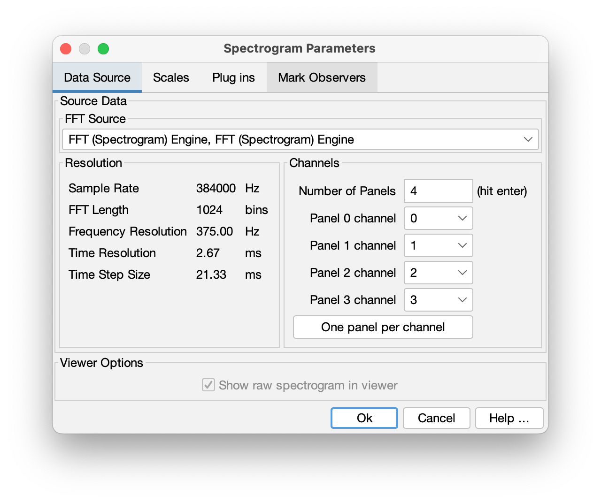{#fig-5 width="517"}


A long-term spectral average (LTSA) is an excellent way to visualise a soundscape over long time periods. An LTSA is essentially a spectrogram which allows a manual analyst to quickly glance at long time periods and pick out interesting sections of data and is useful in pretty-much every analysis configuration. To add the LTSA module click ***File → Add Modules → Sound Processing → Long Term Spectral Average.***

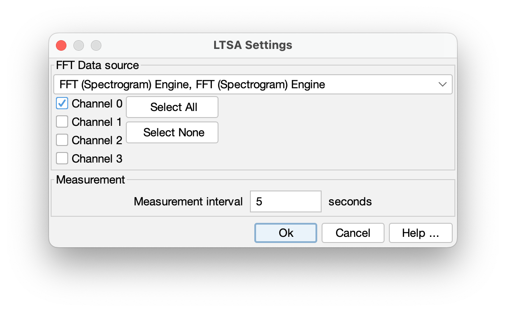{#fig-6 width="523"}


Open the LTSA settings by click ***Settings → Long Term Spectral Average*...** and ensure Channel 0 is ticked. A measurement time of 5 seconds is usually enough.

Finally, to detect porpoises, we need to use a click detection algorithm. Porpoises produce narrow band high frequency echolocation clicks centred at around 130kHz to hunt and sense their surroundings (they also use the same sounds to communicate). The click detector module in PAMGuard can detect and classify these clicks.

Set up Click Detector using default settings for basic porpoise ***Settings → Add Modules → Detectors → Click Detector.*** This will automatically add the click detections displays.

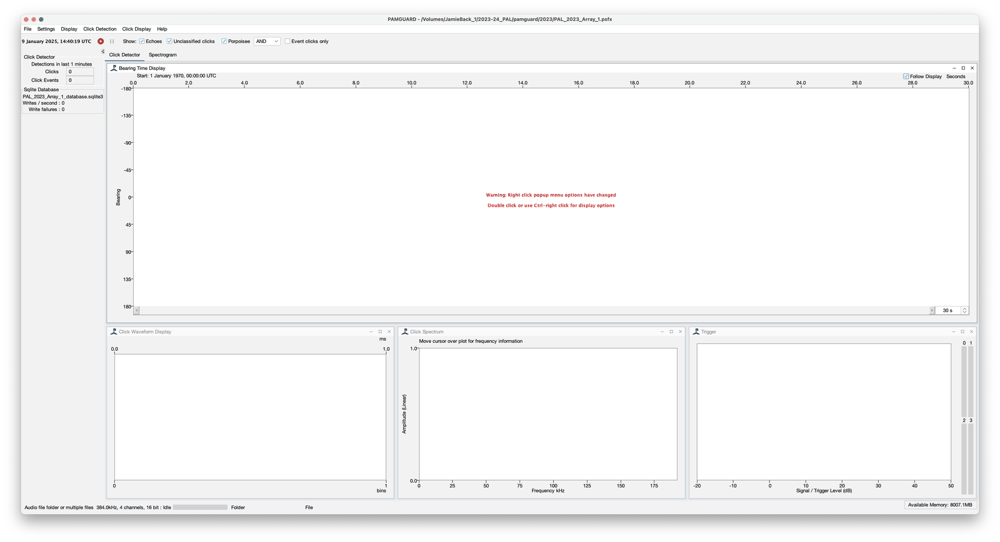{#fig-7}


The click detector is a three-stage process - first any transient sounds of interest are detected, if multi-channel then time delays are calculated, and a bearing localised and finally a classifier is applied to classify sounds that are of most interest. Here we are only interested in porpoises so we will set the detection stage to only process the porpoise frequency band which will help reduce false positives and make data analysis easier.

First go to **Settings → Click Detector → Digital Pre Filter...** Set the high pass to 2,000Hz - this means that the small snippets of sound saved for a positive detection will be filtered making it easier to manually identify porpoise clicks.

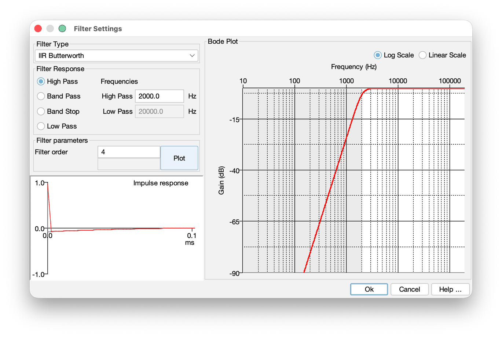{#fig-8}


The most important detection parameter to get right is the trigger filter. The trigger filter pre filters data before it passed to the detection algorithm. Unfiltered data can result in a large number of detections and will potentially mean the algorithm misses clicks. Most echolocation clicks have high frequency components and so it sensible to set the filter band to higher frequencies. Because we are interested in porpoise we can set the filter band to very high frequencies between 100 and 150 kHz. Go to **Settings → Click Detector → Digital Trigger Filter....** and select a ***Band Pass*** filter between 80,000 and 150,000 Hz. Change the ***Filter Type*** to ***Chebychev*** and make the **Filter order** 4.

{#fig-9}


Next go to ***Settings → Click Detector → Detection Parameters***. Click the Source Tab and ensure that all the channels are selected and there is only one Group. If all the channels are part of the same group, then time delay measurements are automatically calculated between the hydrophones for each click which allows bearings to be localised. Also select the ***Trigger*** tab and ensure all channels are used for the trigger -- this just means that any channel which detects a click will result in a click being saved.

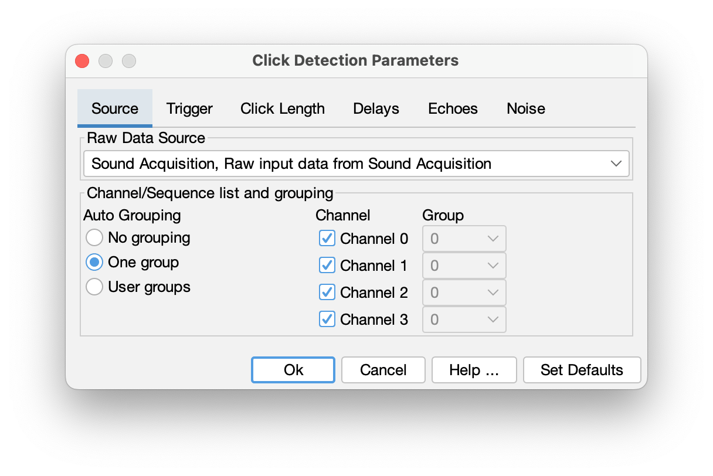{#fig-10 width="514"}


Setting up the detection stage is now complete; however, this will detect any transient sound within the selected frequency band e.g. dolphin clicks, propellor cavitation etc. Whilst these are all useful to provide context for the data, it is also important to identify which transients might be porpoise clicks i.e. a porpoise classifier is needed. The in-built classifier will analyse each detection and determine whether it is a porpoise or not. ***Settings → Click Detector → Click Classification***. Click ***New***. Click ***Set Defaults*** and choose ***Porpoise***. Press ***Ok*** and make sure ***Run classification online*** is ticked and the classifier is enabled. You will see that the default symbol for a detection classified as a porpoise is a red triangle ▲. You can change it, but it's what is commonly used for both data collection and analysis. (Check Nyqvist frequency, if PamGuard complains about frequency range)

::: {#fig-11 layout-ncol=2}
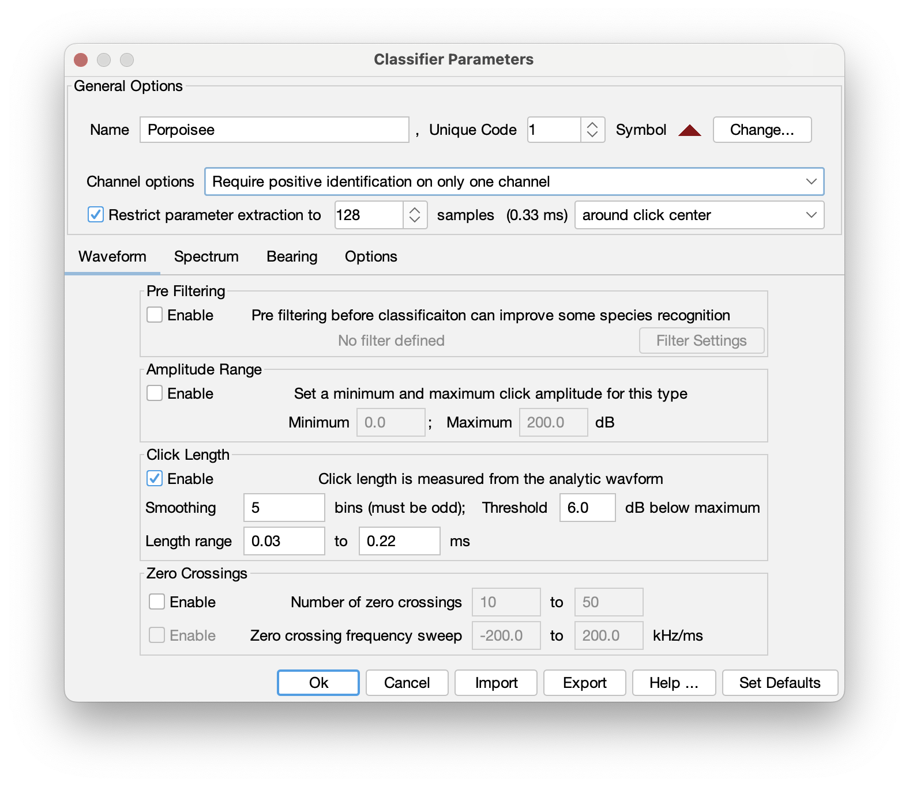

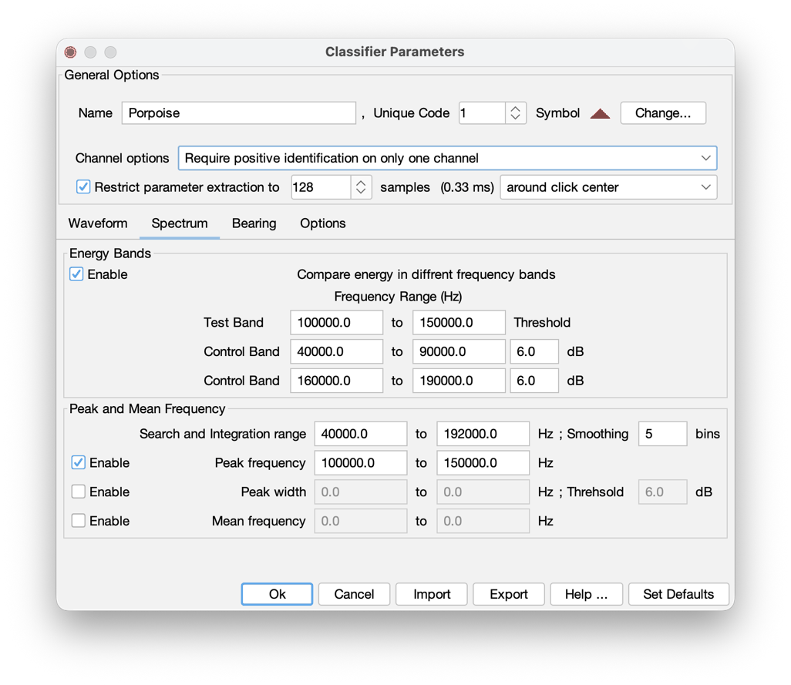

Settings for the click classifier. The click classifier is used to identify detected transients which may be porpoise echolocation clicks.
:::

We want the click detector display to show the classified porpoise clicks as red triangular icons. There are many ways data can be displayed -for example PAMGuard can colour clicks according to annotation, their peak frequency and/or which hydrophone they were detected on etc. The way clicks are coloured is handled by ***Symbol Options.*** Right click on the main click display and select ***More Symbol Options...*.** The ***Modifiers*** section shows the order in which symbols are coloured. You can disable colouring a symbol a certain way by deselecting ***Fill Colour*** and ***Line Colour.*** The order in which symbols are coloured can also be changed by right clicking on the folder icon and selecting ***Move earlier*** or ***Move later.*** Set the symbols to the screenshot below to show classified and manually annotated clicks - annotated click colours will override classified clicks colours here

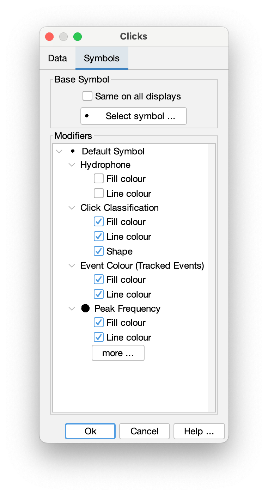{#fig-12 width="346"}


Select **Ok** to close the classifier settings - the click detector is now set up. Save the configuration (***File → Save Configuration***)

# Orientation Data

The SoundTrap ST640 contains a 3-axis magnetometer and accelerometer. This means that it is possible to calculate the heading, pitch and roll of the SoundTrap. PAMGuard provides a handy module to do this, that reads the magnetometer and accelerometer data directly from sud files as they are processed and then calculated the heading pitch and roll. This is usefull for two reasons,

1.  It can indicate whether a lander moved at any point during a deployment.

2.  The heading, pitch, and roll can be used to geo-reference bearing in PAMGuard.

To add the module go to ***File → Add Modules → Sensors → SoundTrap SWV Sensor Import***. This will add the module. Next, open the settings by going to **Settings → *SoundTrap SWV Sensor Import* --** this will bring up the sensor pane. Click on the ***Defaults*** and select ***ST600*** (the only options for now)***.***

{#fig-13}

The SoundTrap SWV Sensor module can also save interpolated orientation to the Hydrophone Array Manager -- allowing detections to be geo-referenced, i.e. a bearing in the click bearing time display becomes the true bearing relative to north instead of a relative bearing to the array. These data are saved to the database, while the raw data is saved to binary files; to minimise the database size, it's often a good idea to average the sensor values, especially for a lander that is sitting on the seabed and so should not be moving. Set the ***Output interval (s)*** to 10s and make sure ***Add orientation to hydrophone array*** is selected. Close the SoundTrap SWV Sensor settings by clicking Ok.

PAMGuard will now extract orientation data from the sud files as it processes.

# Saving data

PAMGuard saves data in two ways, using a database and custom "Binary" files. The database holds information such as GPS data, settings and noise data. Ideally PAMGuard would only use one type of storage, however detector data, such as clicks and whistles/moans, especially for large datasets, can be substantial in size, up to tens of gigabytes. This volume of data slows down databases which is why PAMGuard uses a much more efficient storage system, Binary files. Although Binary files are much faster, they are not human-readable like databases and so require software libraries to open them.

Add both the database and binary storage options to PAMGuard. Click ***File → Add Modules → Utilities → Database***. Click ***File → Database → Database Selection ...*** Click ***Browse/ Create\...*** and select a location and name for your database (make sure it's somewhere you can find it again).

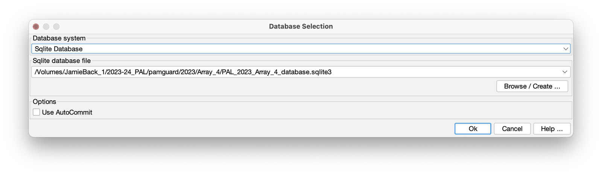{#fig-14}


Next add the binary storage**. *File → Add Modules → Utilities → Binary Storage*.** You will need to specify a *folder* that the binary files will be written to. Click ***File → Binary Storage Options...***

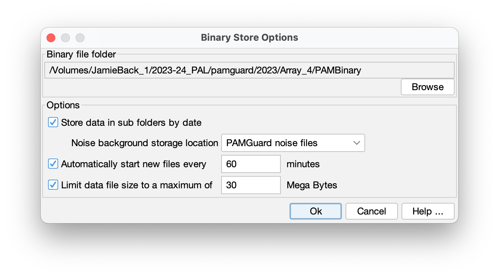{#fig-15 width="563"}


In the Binary Storage Options dialog box click ***Browse*** and select a storage folder. Again make sure you remember the location (usually it's sensible to put the binary folder in a parent folder also containing your database and .psfx settings file).

If you click ***File → External Data Storage...*** you will now see that ***PAMGuard*** has selected which data outputs will be saved to which type of storage.

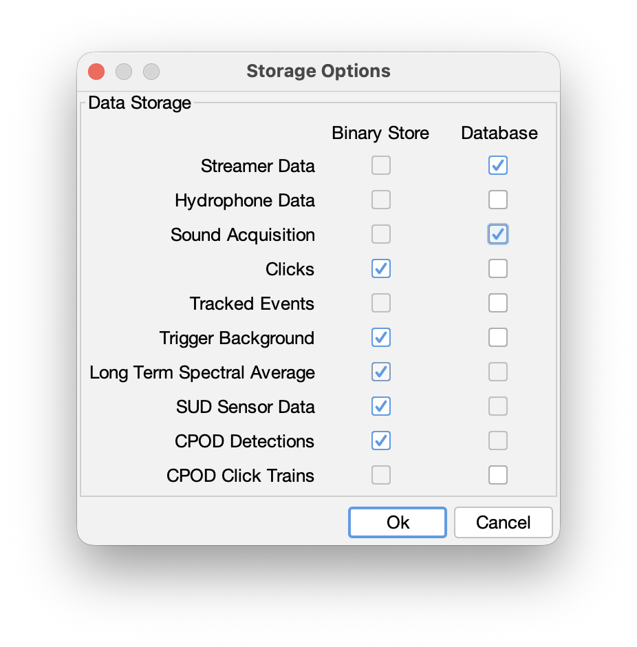{#fig-16 width="421"}


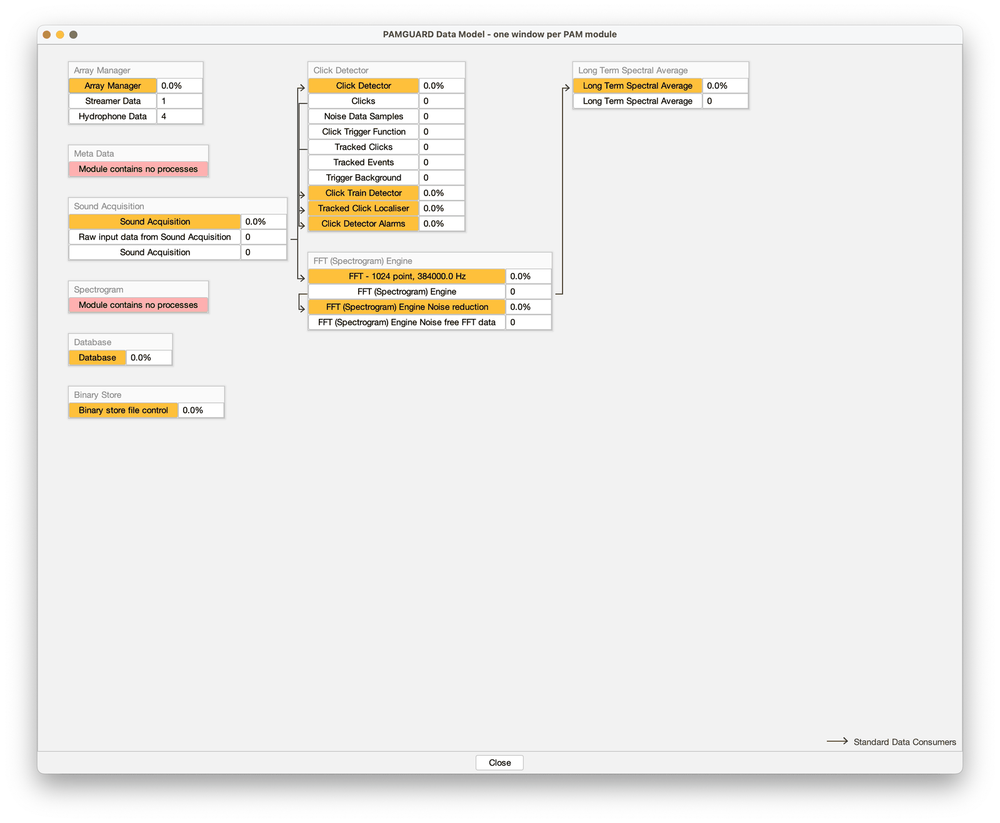{#fig-17}

Once everything has been set up it useful to open the data model and check the acoustic workflow is what you expect. Go to ***File → Show Data Model\...*** it should look like @fig-17 and is a relatively simple configuration by PAMGuard standards.

Save your configuration and hit the red run button . PAMGuard will now start processing the data. As it does so check the spectrogram tab and the click detector tab -- this will help identify any errors- for example if any of the channels are not working etc.

# Viewing the results

Once data has finished processing PAMGuard viewer mode can be used to view the results, reprocess some parts of the data, manually annotated and export results.

Open PAMGuard viewer mode. Select the database you used for processing and the correct folder that binary files were saved to (very important).

If opening for the first time or if more data have been added to either the database or the binary PAMGuard will want to create a datagram. This is an overview of all data collected which allows users to navigate to interesting section in the dataset. The Datagram Bin size is the time bin in which data are averaged. The default bin size of 600 seconds is fine in this instance. Lower bin sizes increase the resolution of the datagram, however, requires more memory.

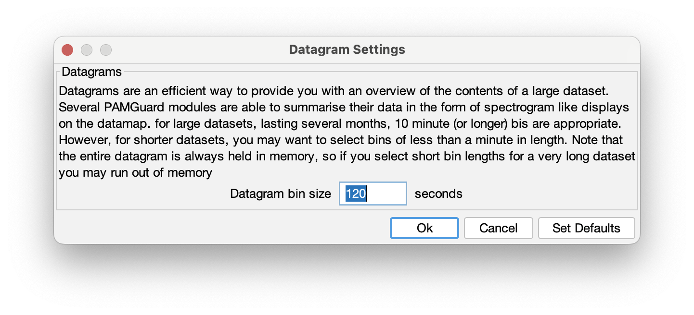{#fig-18}


Click ***Ok***. If the datagram has not already been constructed PAMGuard will iterate through all the binary files creating a summary of each data type i.e.,LTSA and clicks in this case This can take some time.

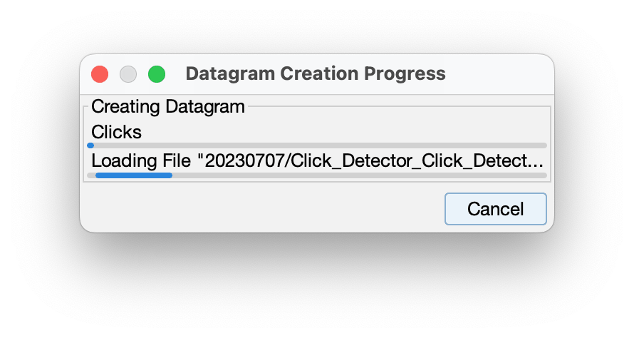{#fig-19 width="495"}


Once processing is complete, PAMGuard the data map can be viewd in the ***Data Map*** tab. This shows the datagram for each data stream. Here we can see (from top to bottom) the the Sound Files processed, detected clicks, click noise data and the LTSA. Most data maps are simply the number of data units per time period but some modules, such as the click detector and LTSA show more complex datagrams which are 3D time, frequency, amplitude, or histogram plots. Colours indicate the amount of data within each time/frequency, with white as nothing and then blue → green → yellow → orange → red showing more data. You can click on a datagram and use the mouse wheel to change the colour limits.

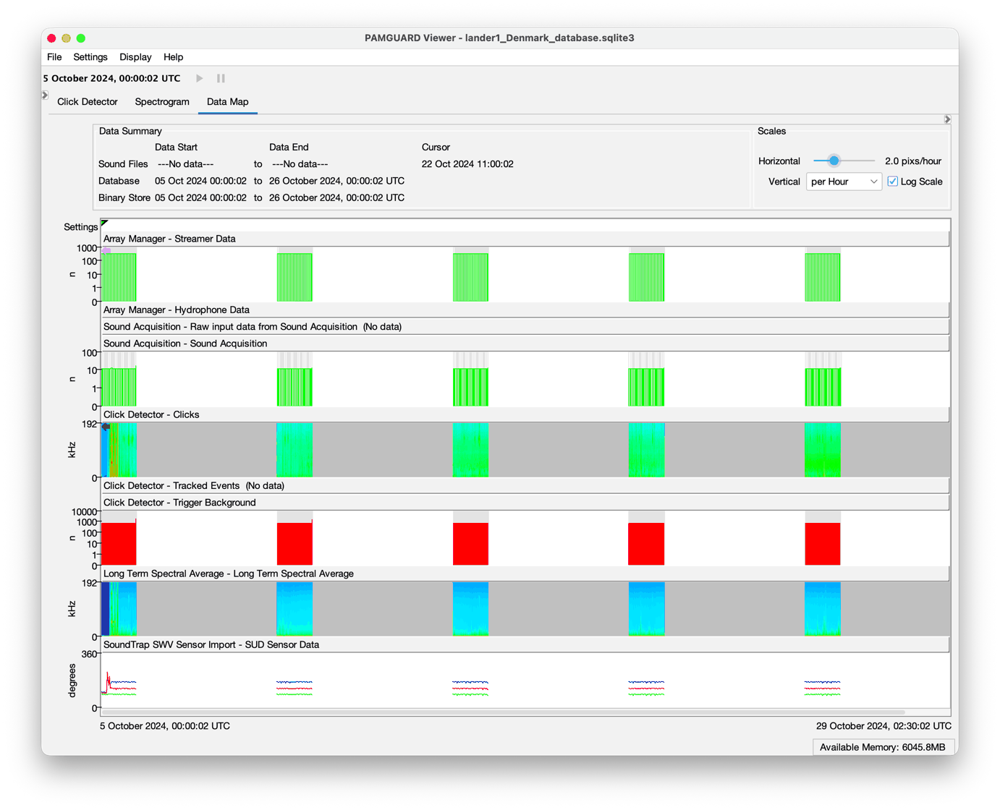{#fig-20}

The ***Data Map*** also allows users to change the time scale. Move the slider in the ***Scales*** pane to increase or decrease the time scale. Use the time scale to zoom into a particular section of data or zoom out and view the entire dataset.

The click datagram also has a feature whereby users can view the number of classified clicks per unit time. Right the display and untick ***Show datagram.*** The Click Detector data panel will now show a time series of black and red bars -- the black indicates the number of detected clicks and red indicates the number of detected porpoise clicks.

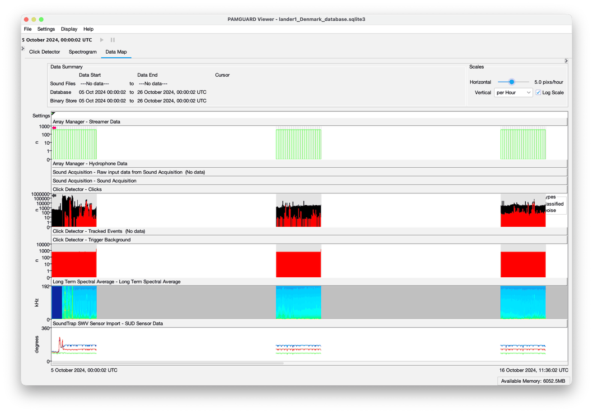{#fig-21 width="655"}


Navigating through the click data map it should become apparat that there are spikes in the number of dected porpoise clicks. This usually indicates a porpoise. Right click on one of these spikes and selected ***Centre Data Here*.** PAMGuard will then load up a section of data so it can be viewed on a display. Click the ***Click Detector*** display. You should notice that there are quite a from classified clicks which are clearly from porpoises.

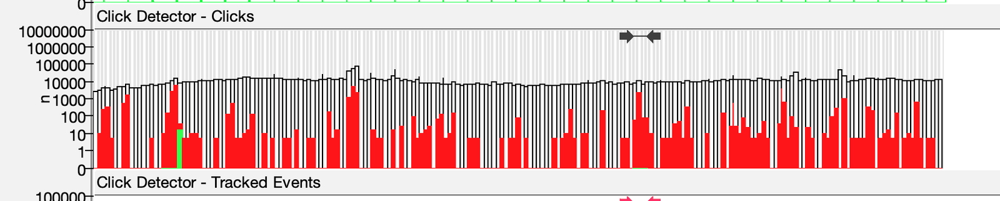{#fig-22}


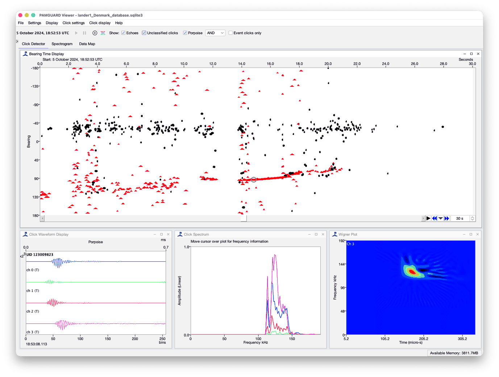{#fig-23}


You can set how much data PAMGuard loads up in a period by clicking the down arrow in the bottom right of the spectrogram display. This will bring up a small window. Make the **Duration** 30 minutes. PAMGuard will then load up 30-minute chunks of data each time you move to a new section of the dataset. The reason for this is that as the datasets are so large, PAMGuard cannot load all detections into memory. Keeping time chunks relatively short reduces load times and memory requirements, making PAMGuard faster and more stable. Once you want to move on to another section you can either go back to the Data Map and right click **Centre Data Here,** click the down arrow and manually enter a **Start Time** or click the double arrows forward or back to go to the next or previous section of data.

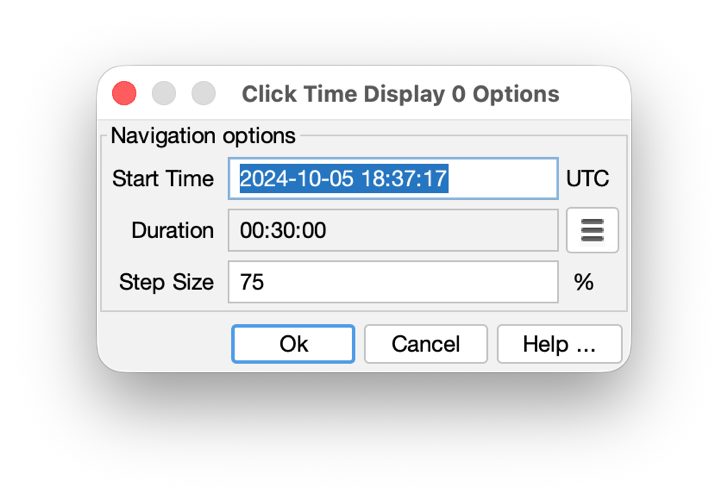{#fig-24 width="364"}


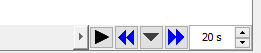{width="261"}

From left to right, the toolbar controls are:

-   **Spinner** -- changes the time period of data shown in the display.

-   **Play** -- plays through the data as if it were being collected in real time.

-   **Double arrows** -- load up the preceding or next 10-minute section of data into memory.

-   **Dialog button** -- opens a dialog to set how much data is loaded into memory. Also allows a user to jump to a specific time period.

Now use the navigation system to explore the dataset. Use the ***Data map*** to identify sections where there might be porpoise and check for detections. Note that the click display can be switched between bearing and amplitude by right click on the display -- while bearing is useful for looking at porpoise click trains it is often useful to use the amplitude display to distinguish whether and event is a porpoise or boat echosounder. Make sure you are totally happy using all the navigation and display tools before proceeding to the next section.

# Viewing orientation data

The sensor data is shown as heading pitch and roll in the datagram as shown in @fig-25. Sensor data can be viewed in the Time Display. Add a new user display by selecting ***File → Add Modules → Display → User Display.*** Select the new tab that appears and, at in the top men select ***Display → new Time Base Display fx.***

# Reprocessing clicks

PAMGuard viewer mode can reprocess detection data - you cannot re-detect clicks from raw data, but you can reclassify, redo bearings, recalculate time details etc. this can be very useful when exploring the dataset and for optimising automated classifiers.

## Reclassifying clicks

{width="22" fig-alt="Reanalyse clicks toolbar icon"} If you navigate to a porpoise detection you may notice that there are quite a few missed porpoise clicks. This is because the classifier has been set to identify a porpoise click only if all channels pass the click classifier. If we set to just one channel that needs to detect a click or average over channels, then the classifier becomes less sensitive and a lot of these missed clicks will be classified correctly. Open the click reprocessing window either by selecting the icon in the Click detector display or going to ***Settings → Click Detector → Reanalyse Clicks...***

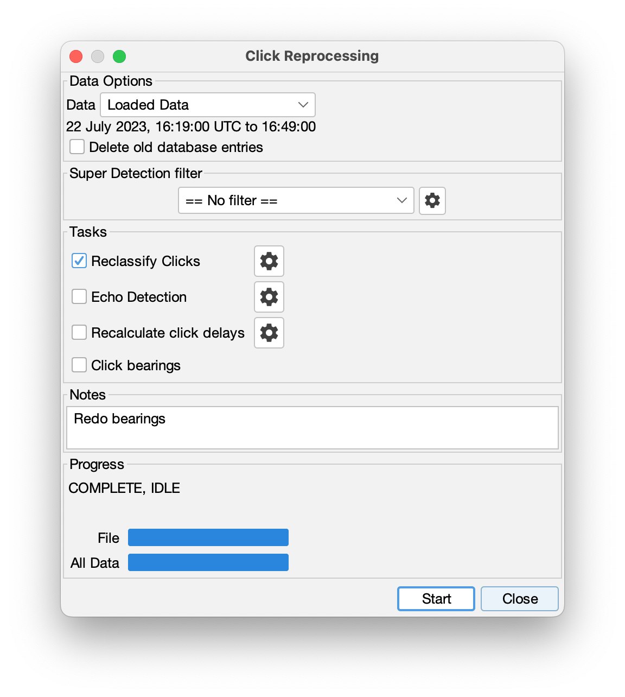{#fig-25 width="463"}


Select ***Reclassify clicks*** and press the settings icon. This will bring up the click classification table. Double click the Porpoise classifier. Change the ***Channel*** options to ***Use mean parameter values of all channels*** and click ***OK.***

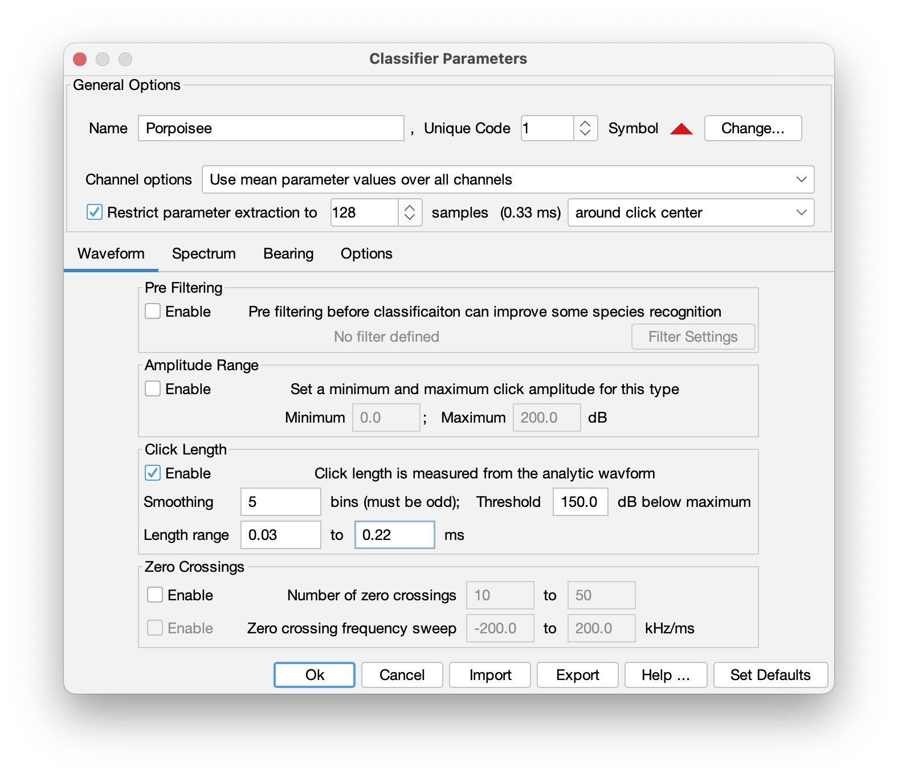{#fig-26}


We have a large dataset, so we need to tell PAMGuard to process through all the clicks using the new click classifier -- it's not instant. Anytime we change settings we have to repeat this process. In the top ***Data options*** menu select ***Loaded Data*** to process only the currently loaded clicks and press ***Start***. PAMGuard will now run all clicks loaded into memory. To reprocess the entire dataset select **All Data** or to reprocess a specific time period select ***Select Data.***

Once PAMGuard has finished you will notice that some of the click classifications have changed and many of the false negative detections will now be correctly classified as porpoise.

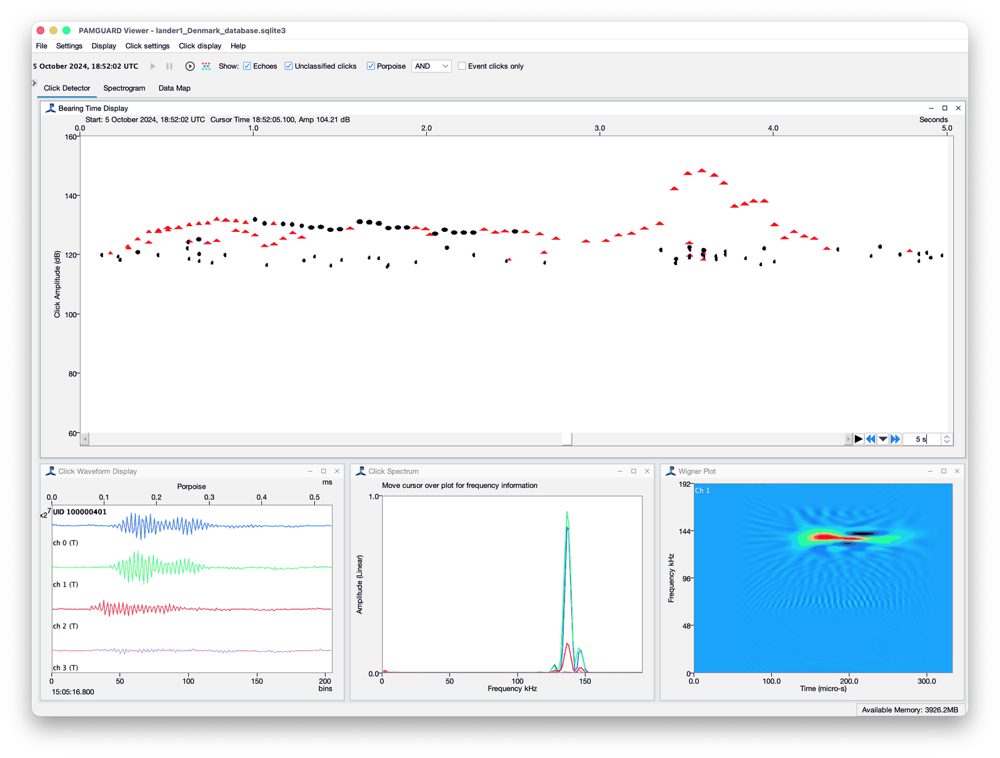{#fig-27}


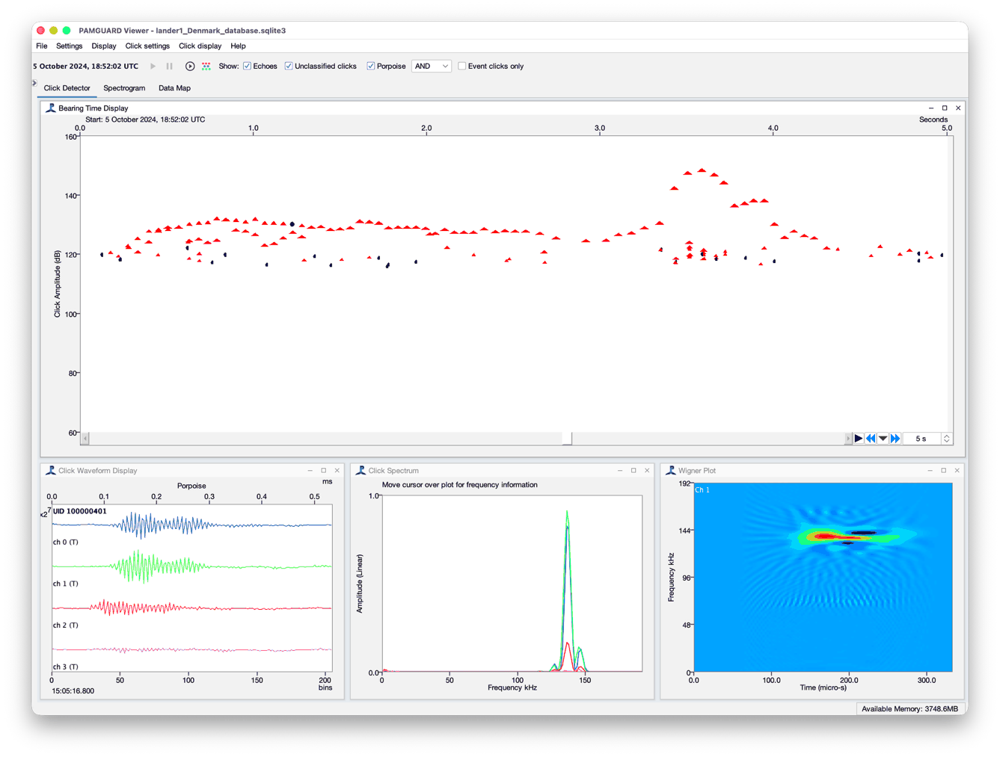{#fig-28}


## Reprocessing bearings {#sec-reprocessing-bearings}

Localised bearings are calculated form time delay measurements between clicks arriving at different channels on the array. However, because porpoise clicks are relatively narrow band, they can be quite difficult to cross-correlate and time delay measurements are often error prone leading to incorrect bearings. PAMGuard has a number of signal processing tools which can help improve the localisation of porpoise clicks. Open the click reprocessing dialog and select the settings button next to ***Recalculate click delays.***

{#fig-29 width="403"}


Click on the Porpoise ***Change*** button and set up the Delay measurement to filter data between 100 kHz and 150 kHz, up sample x4 and restrict the length to 200 samples so we don't try and cross-correlate echoes.

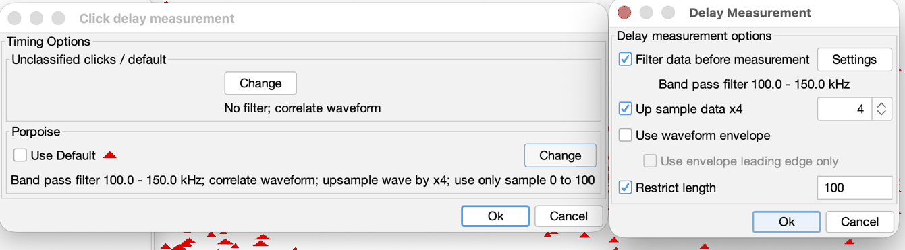{#fig-30}


Reprocess the loaded data and you should see the bearing improve considerably.

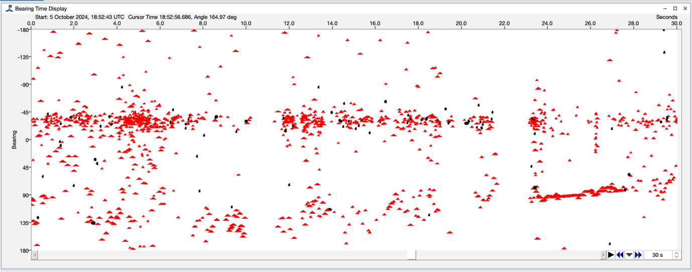{#fig-31}


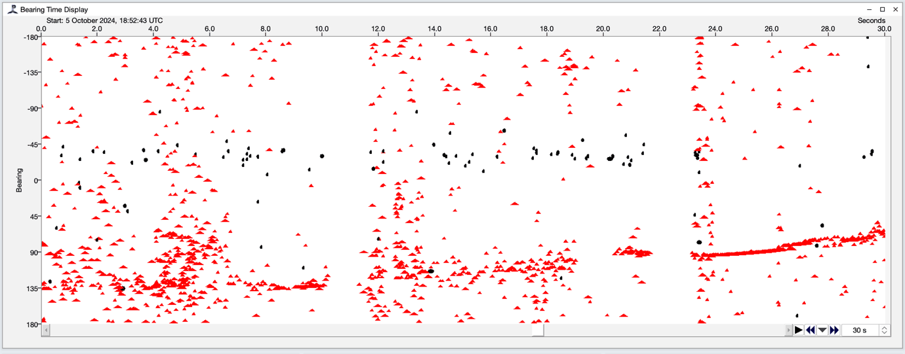{#fig-32}


If you're really interested in the maths behind this, try reading our (very boring) paper on the NBHF time delays.

> Gillespie, D. and Macaulay, J. (2019) 'Time of arrival difference estimation for narrow band high frequency echolocation clicks', *The Journal of the Acoustical Society of America*, 146(4), pp. EL387--EL392. Available at: <https://doi.org/10.1121/1.5129678>.

Once happy with the click bearings settings reprocess the entire dataset using the All Data option in @fig-28.

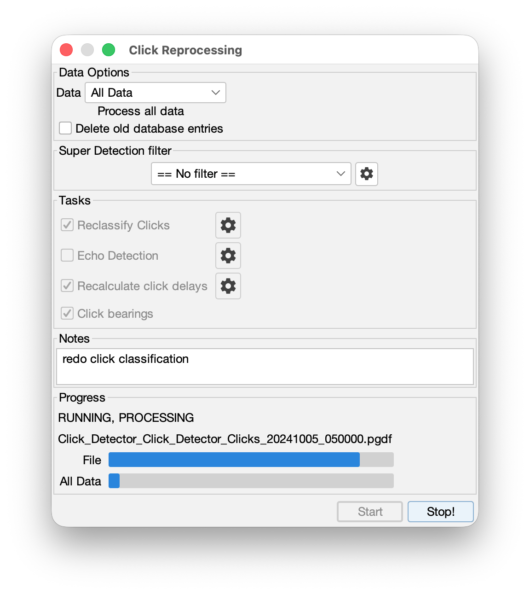{#fig-33 width="481"}


# Annotating clicks

Now that we have classified clicks, we can efficiently navigate to interesting sections of the dataset and manually annotate events. This can be done click-by-click, or by storing multiple clicks belonging to the same event in a single move.

Go to an interesting section of data using the ***Data Map*** as described above, then look at the bearing/time display in the Click Detection tab. Scroll through until you find detections that looks like they should be saved as porpoise detections (anything including red triangle, although beware false positives and false negatives). The figure here shows a porpoise click train which needs to be marked and stored to the database.

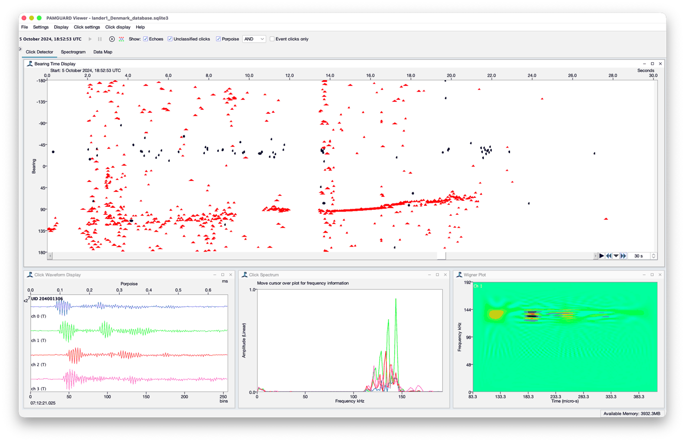{#fig-34}


To see the classified clicks better (in this case porpoise clicks - the red triangles) you can untick the box at the top of the window ***Unclassified clicks**.* The bearing time display will now show only the classified clicks (depending on your settings you may have more options i.e. echoes, other species, etc.). Right click on a click, check that the waveform and power spectrum indicate a convincing porpoise detection and, if so, select ***Label click\...*.**

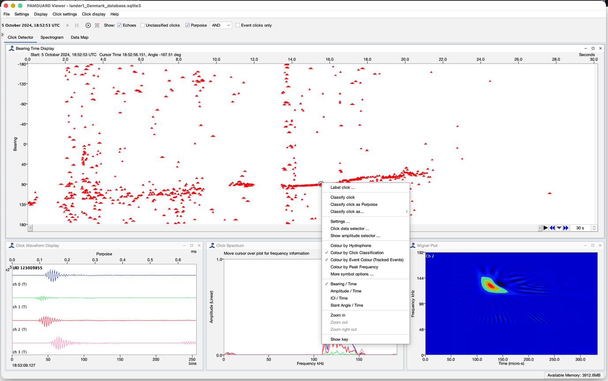{#fig-35}

This will bring up the event dialogue box. Here you can create a new event by selecting the ***New Event*** button or add the click to an existing event by selecting any event from the Event list (the Estimated number of animals and Comment fields are not compulsory, so only fill them in if you find them useful). Note that when you first create an event the Click event dialog will have no evet types in the ***Event type/species*** selection. Click on the cog icon next to the selection box and this will bring up a dialog where you can set event types. For example, some useful event types would be

PP: a porpoise

BC: boat cavitation transients

ES: echosounder.

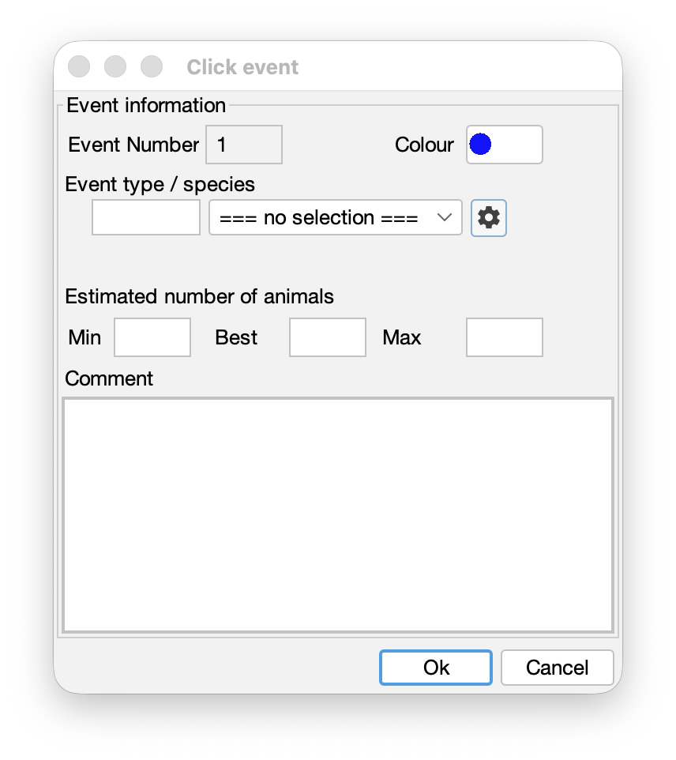{#fig-36 width="345"}


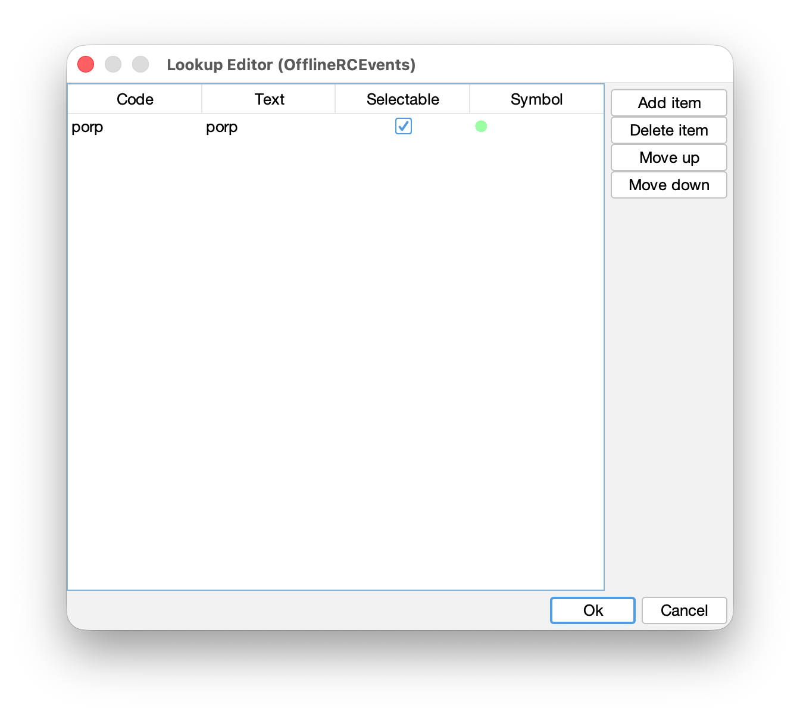{#fig-37 width="625"}


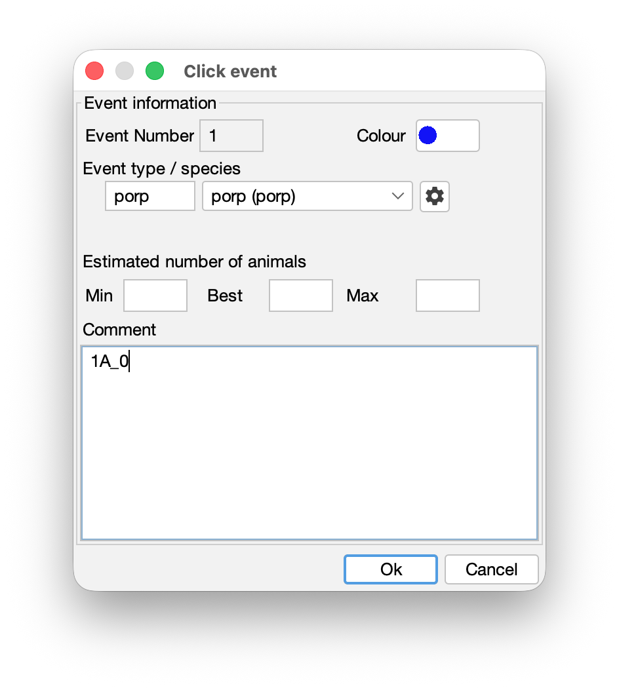{#fig-38 width="388"}


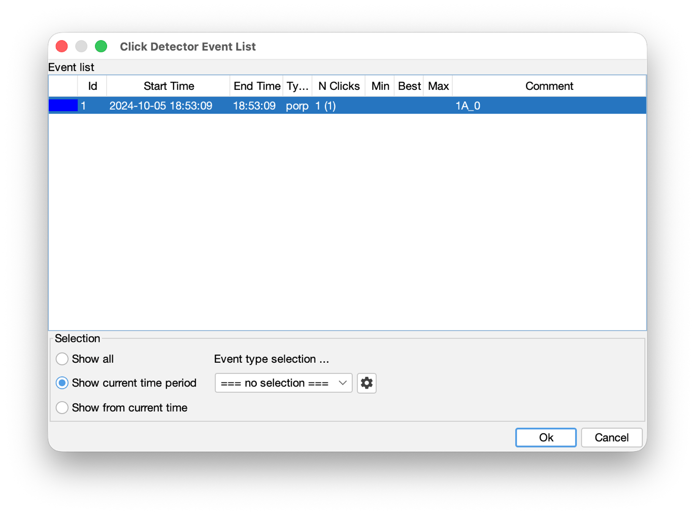{#fig-39}


Multiple clicks can be selected using the advanced area selection tool. Double click on the bearing/ time display. This will bring up a dotted line which you can use to draw around a group of clicks. By joining up the ends of the dotted line the selected area should appear grey. Double click mouse to start selection or drag square with mouse.

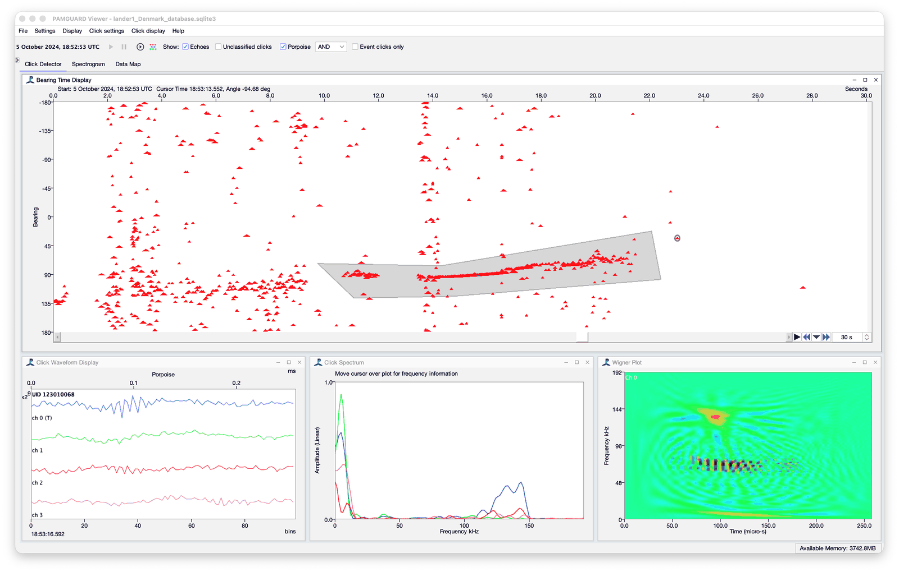{#fig-40}

All the clicks within this grey area can be added to an event by right clicking inside the grey area and selecting ***Label Clicks*** or use the key short cut *\'Ctrl+L\'*. Note that there are also other options available such as removing clicks from a certain event etc. So if you made a mistake, don´t panic.

If you want to check through the clicks of your boxed up event before saving it (to check that all the clicks are good enough to include, and to help to decide what event type you will use), you can either use the non-outlined play button which runs automatically through all clicks or use the left and right arrow keys to go through them once the clicks are selected.

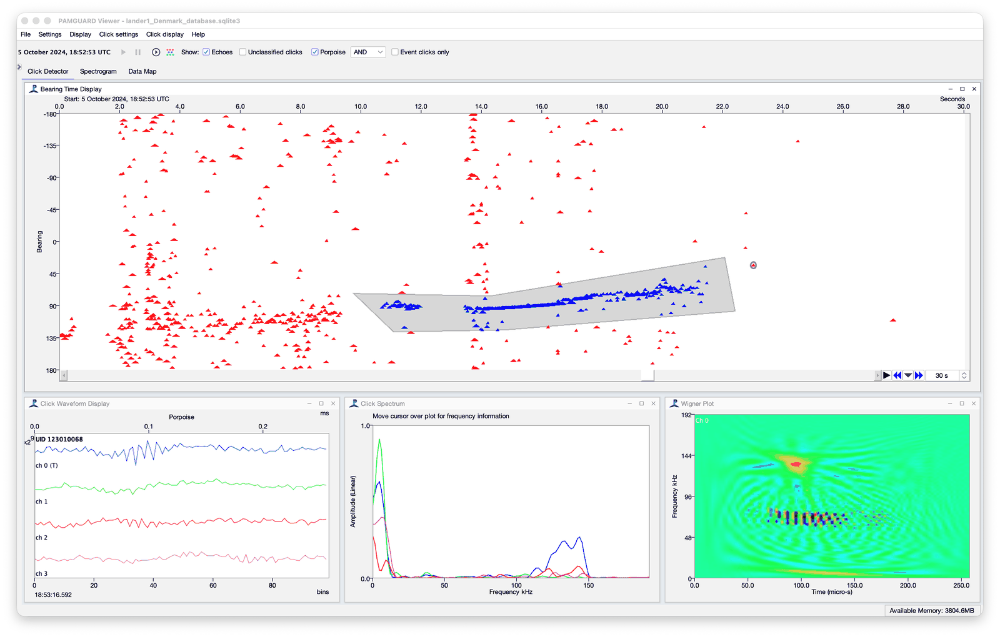{#fig-41}

When marking an event, also look at the non-classified clicks surrounding it. They might also be porpoise clicks (just not classified). Decide if you should add them to your event.

Click trains should be cleaned up by removing non-directional clicks and echoes, so that a clear directional line of clicks is achieved. This will enable a more accurate localisation.

## Amplitude selector

The amplitude selector is effectively a filter. It allows you to choose only clicks above a certain amplitude threshold. This is useful if your data show extensive background noise or echoes and you are trying to extract a "tight track" showing the bearing change for the primary click detections.

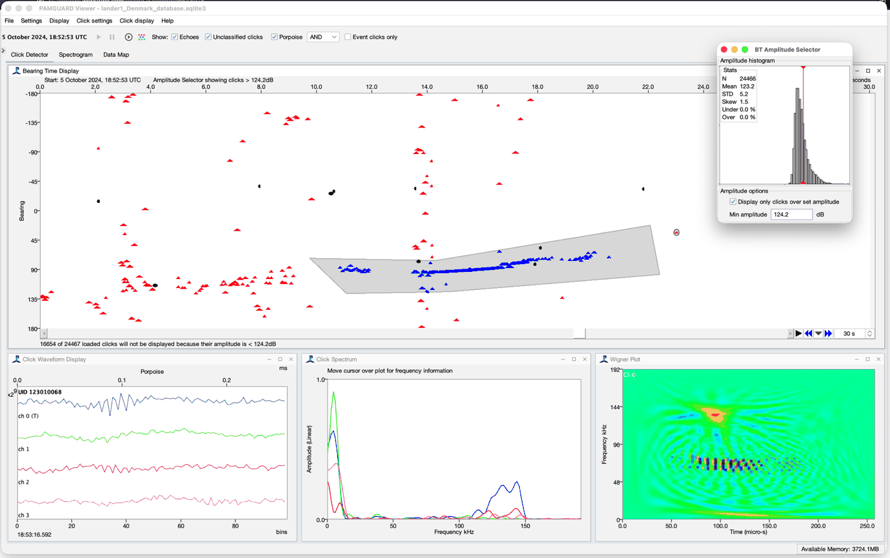{#fig-42}

Scale

A window for the amplitude selector will open showing an amplitude histogram and some descriptive statistics from the clicks shown in the current window. Check the 'Display only clicks over set amplitude' box, then enter a sensible threshold level in ***Min Amplitude*** box which can be judged by viewing the histogram. A red line appears in the histogram which you can drag with the mouse changing the amplitude threshold and allowing fine tuning. The clicks shown in the BT display change accordingly. When the amplitude selector is active a message appears at the bottom of the bearing time display which shows how many clicks are not displayed with the amplitude threshold currently chosen.

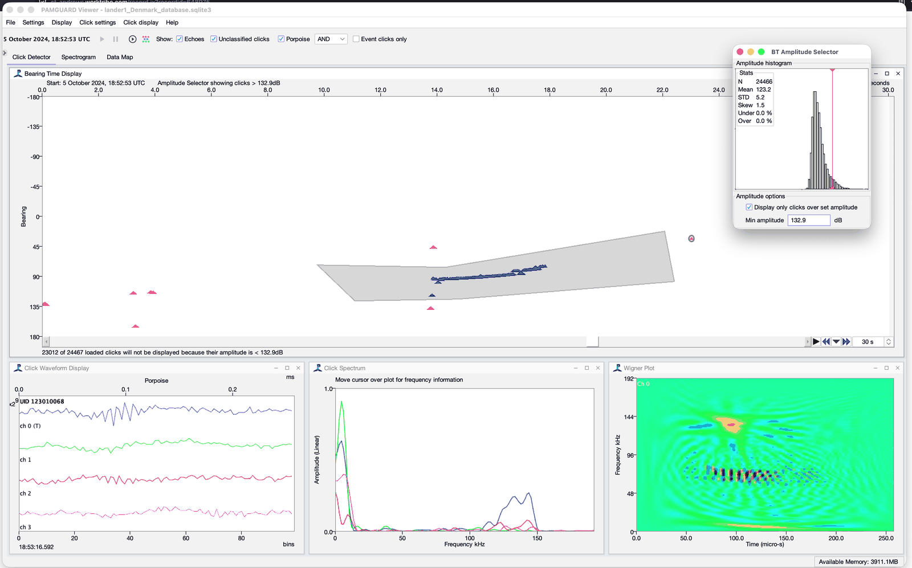{#fig-43}

When using Amplitude Selector you will need to note down the settings if you want to keep a record of them as it is currently not saved automatically to the database, when the event is saved.

## Manually altering a bearing

It can be difficult for automated algorithms to calculate time delays of porpoise clicks, even using the improved methods described in @sec-reprocessing-bearings. When manually annotating clicks, it is sometimes useful to manually check the time delays. Select a click and then in the waveform display drag the mouse to select two direct path clicks on two channels.

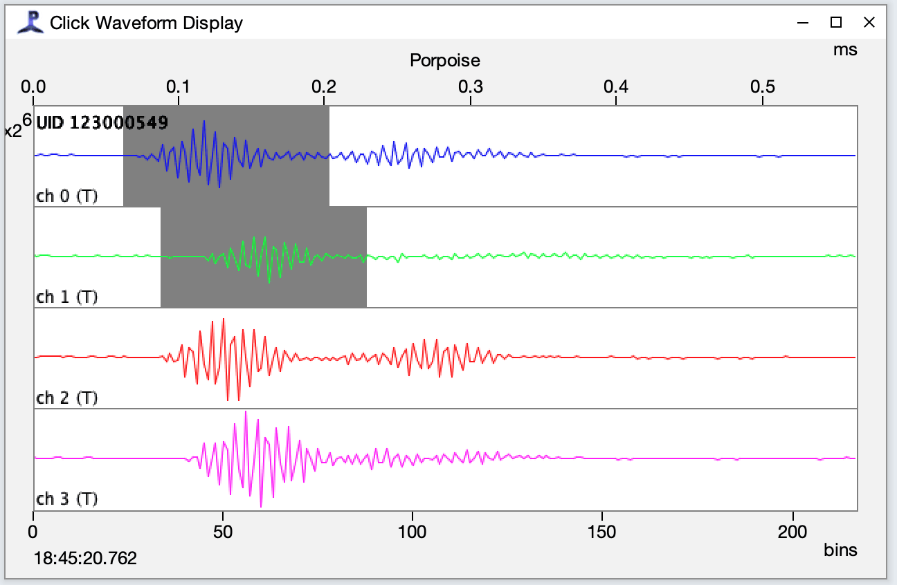{#fig-44 width="391"}


Once click sections on two channels have been selected the Delay correction dialog will appear. You can drag the black bar in the correlation graph to match the waveforms as you see fit -- once happy, click OK and the click bearing will automatically update. Note that for 4 channel data there are six time delay combinations -- all of them may potentially need altered to update the bearing accurately.

Note: if you recalculate the click bearings automatically all manual time delay changes will be lost!

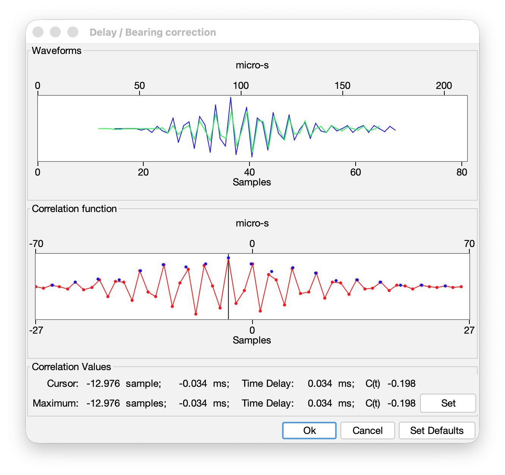{#fig-45 width="518"}


## Manual annotation standards

Because we are localising and click-train algorithms are currently not as well developed as the bioacoustics community would like, it will be necessary to take a semi-automated approach to processing data i.e. we will need to manually annotate all porpoise click trains using the tools described in the previous sections. It is important to have standard for doing this, especially as we need to match click trains between landers i.e. we have to have a consistent way defining what an event is and labelling events correctly between landers.

Some standards we would recommend

-   Start a new event if there have bene no porpoise clicks within a track for 30 seconds.

-   Give each event a serial number in the comment section. For events which match on different arrays, set the same serial number.

# Exporting bearings

There are currently three ways in which data can be exporting in PAMGuard, programmatically through MATLAB ([PAMGuardMatlab](https://github.com/PAMGuard/PAMGuardMatlab)), R ([PamBinaries](https://github.com/TaikiSan21/PamBinaries)) (Python coming soon), to an external database such as Tethys or directly via the exporter.

Exporting using a programming language is very flexible but requires programming know-how and Tethys databases are a whole separate tutorial. The in-built exporter in PAMGuard is easy to use and allows users to export to various file formats and filter data by time or type without the need for any code. Users can then go on to process the data in whichever way they require.

To open to the exporter, go to ***File → Export Data...*** This opens the exporter dialog.

## Exporting Events for R

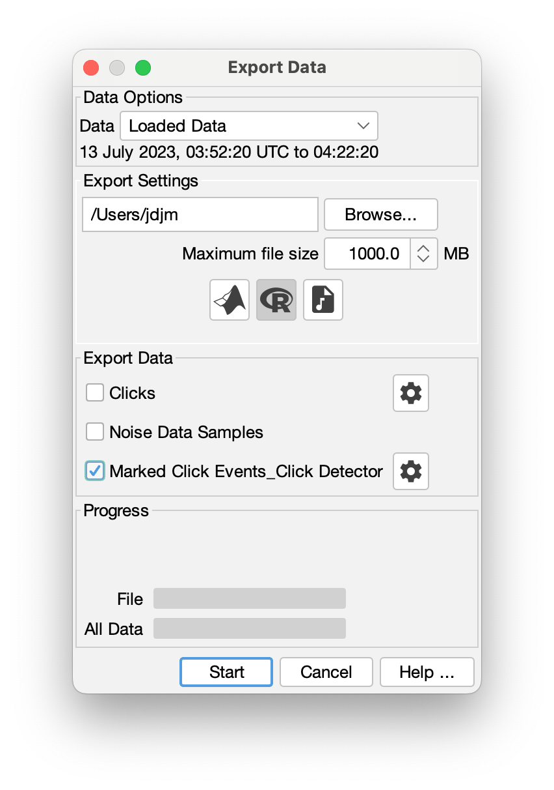{#fig-46 width="363"}


Here we are going to export all manually annotated clicks to an R data frame. Select the R icon and select ***Marked Click_Events_Click Detector.*** In exactly the same way as the click reprocessing dialog, users can select whether to export only loaded data, the entire dataset or selected time periods. Here we are going to export all annotated data so select ***All Data***. Click ***Browse...*** to select a folder location for the data and begin exporting by select ***Start***. Once the export has finished there should be a time stamped .RData file in the output folder that was selected. Import this into R Studio by typing (replacing the path with your newly created .RData file)

``` r
load("/Users/myusername/PAM_2019_11_14_125025_Tracked_Events.RData")
```

into the console. This will import the data frame which consists of a list of all the marked-out events. Each event contains a sub list of all the clicks in the event and metadata on the times etc. for the event itself and for each click. In the next section you will use these data to make plots of porpoise behaviour around the net.

{#fig-47}


## Exporting Events for MATLAB (and Python)

Exporting data to MATLAB or Python is exactly the same as R except the MATLAB icon should be selected. Note that Python can read .mat files using **pymatreader** for example.

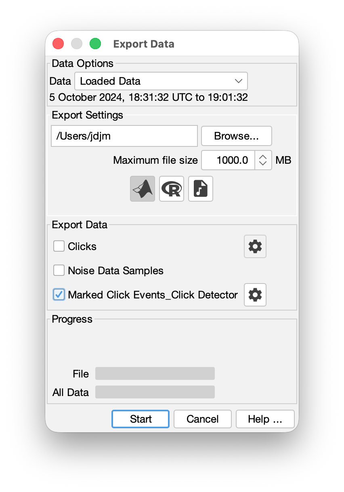{#fig-48 width="362"}


Loading a .mat file into MATLAB is very easy. Either drag and drop it into the workspace or use

``` matlab
clicks = load("/Users/myusername/PAM_2019_11_14_125025_Tracked_Events.RData")
```

The clicks variable will appear as a structure in the workspace which can then be accessed programmatically.

# Comparing to CPOD data to SoundTrap recordings

Each lander also had an associated CPOD. It is useful to visualise the CPOD data alongside the lander data, especially for investigation time offsets and getting a feel for detectability.

In this section, we will import CPOD detections so that they can be viewed alongside the acoustic recordings on each lander. To do this we have to first add the CPOD module. Go to ***File → Add Modules → Sensors → CPOD Detector Import.*** Open the module by selecting ***Settings → CPOD Importer...***

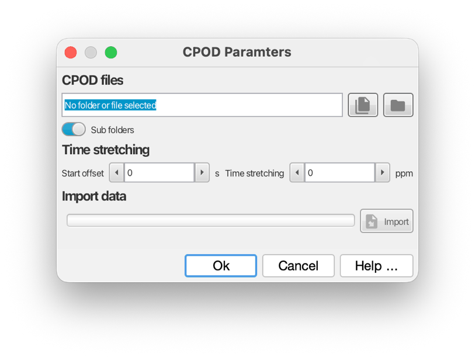{#fig-49 width="407"}

The CPOD import dialog allows users to either select files or a folder of files. The files should be CPOD or FPOD click or click train files i.e. CP1/FP1 and/or CP3/FP3 files respectively. The user can either use the files button to select specific data files or the folder button to a load a folder of files. The way PAMGuard works is that it will import raw detection data first (i.e. CP1 and FP1 files) and, if click trains are available (i.e. CP3 and FP3 files), it will add click train data to the raw detections as "super detections" which are saved to the database. If the CP1 file is not available or selected, then PAMGuard will import click trains from the CP3 or FP3 files and the raw detections from the click trains in CP3 files -- this will mean only detections which are part of clicks trains will be imported (as that's the only data in the file). In other words importing CPOD or FPOD data follows this logic;

-   If CP1 or FP1 files only then import raw detections -- no click trains will be available.

-   If CP3 or FP3 files only then import click trains and raw detection of from those trains

-   If CP1/FP1 and CP3/FP3 are both available then import detections and click trains -- match the detections from click train files to the raw detections file.

PAMGuard saves the raw CPOD or FPOD click detections to binary files (just like clicks and whistles) and saves the click trains to the database. Click train data are therefore human readable and CPOD detections can be extracted using the PAMGuard-MATLAB and (hopefully soon) PAMBinaries R library.

::: {.callout-note}
## A note on CPOD/FPOD data

*CPODs and FPODs are the longest lasting high frequency acoustic monitoring devices that are available, by a very long way. They are also less expensive than many competing devices. The way this is achieved is by compressing data -- CPODs record click detections, not raw sound. The data saved per click detection is extremely sparse -- i.e. consists of a few measurements such as bandwidth, peak frequency, etc. CPOD detections therefore have no waveforms (like you might see from a SoundTrap for example). FPODs do record some waveform information, but only for a small subset of clicks.*
:::

Here we will import just the CP3 files i.e. the click trains detected on the CPOD. Select the file button and select the **CPOD**. The dialog should show there are 2 files you could import (CP1 and CP3). Just select the CP3 file. Click Import and wait for processing to finish. This may take a little while, so good moment for a cup of tea.

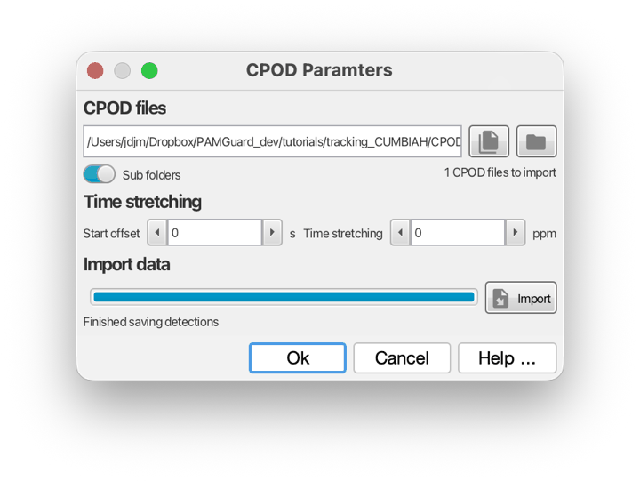{#fig-50 width="360"}

## Viewing CPOD data in PAMGuard

Once the data have been processed the data map will reprocess and in the ***DataMap*** display the CPOD data will appear in the ***CPOD_Detector_Import_CP1*** and ***CPOD Click Trains*** data map. Note that the CPOD a lot more data than our recording sample.

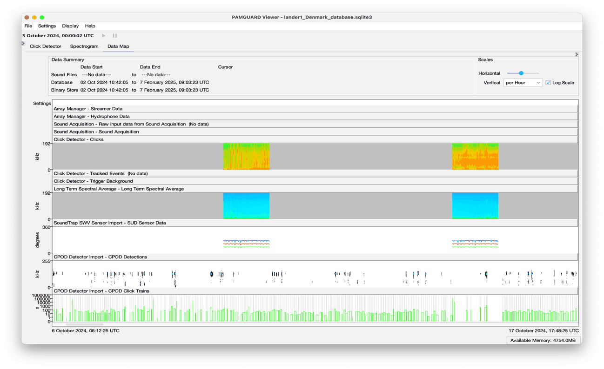{#fig-51 width="646"}


The detections data map shows the frequency distribution of clicks. If you zoom in (using the scale settings as above) then porpoise detections will appear as a more narrow bandwidth section of data.

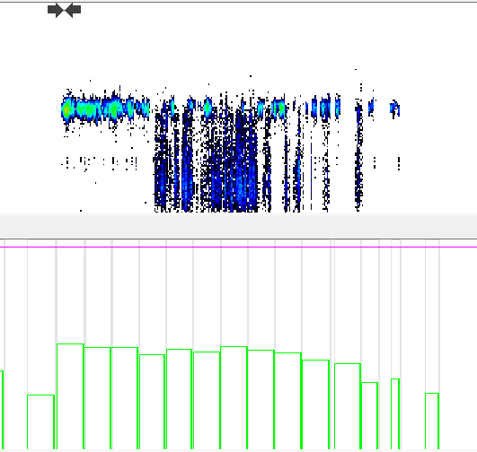{width="406"}

To view the data we will need to an appropriate display. To add a display first go to ***File → Add Modules → Display → User Display*** to add a new display tab. Click on the new tab, then select ***User Display*** in the top menu and select **New time base data display fx.** This will add a new blank time display. The time base display can display almost any data stream in PAMGuard; here we wish to view CPOD so click the ***+ Data*** button and add ***CPOD Detector Import, CPOD Detector ImportCP1*** data. Next click on the three bars in at the bottom right of the display; this will bring up PAMGuard's viewer mode navigation settings.

![PAMGuard’s generic viewer mode navigation dialog is also used in the time base display. This allows users to set the time and amount of data loaded into memory. As a reminder, Start Time indicates the start of the loaded data. Duration is the amount if data that is loaded and step size is the data overlap when the forward or backward arrows are used to quickly skip to the next section of data. Note that duration is NOT the visible data in the display – that is controlled using the time spinner at the bottom right of the display or the scroll bar.](../images/pamguard/image56.png){#fig-52 width="342"}


Select 1 hour of data in the ***Duration*** Menu -- CPOD detections are highly compressed data and so 2 or even 12 hours of data can be easily loaded. Click OK on ***Navigation Options*** dialog and then click on the ***Data Map*** tab, right click on an interesting section of data and select ***Centre data here.*** This will load the CPOD data in the Time Display FX.

{#fig-53}


Initially the CPOD data will be displayed on an amplitude display much like the Click Detection in the click display. However, this is not a particularly informative way to display CPOD detections. To better visualise the data, we will colour each detection by frequency and display amplitude as a stem plot instead of scatter points. ***First select Amplitude (stem) dB re 1μPa*** on the left settings pane. Next click the cog at the right of the display to bring up the display options. Click on ***Peak Frequency*** to expand the settings and then select both **Border** and **Fill.** CPOD detections will now be coloured by their peak frequency between the ***Min freq.*** and ***Max freq.*** limits. To use the same colour scheme as CPOD.exe software, select the HSV colour scheme (see @fig-41) and set the upper limit to around ***170000 Hz**.*

::: {.callout-note}
## A note on PAMGuard's universal symbol chooser

*PAMGuard has a symbol chooser which is used across all displays (e.g. click detector, map spectrogram, Time Base Display etc.). Symbol colouring sounds simple but it can get quite complicated -- for example how to do we colour clicks? First by classification, then by event, then by click detection? Or perhaps by peak frequency, or annotation e.g. deep learning prediction? The idea behind the symbol chooser is to have a universal method to colour symbols. It works by starting off with a **Default Symbol.** The default symbol is then sequentially coloured or altered by a series of symbol choosers which can be enabled or disabled by the user as needed. The available symbol choosers depend on the data stream. For example, clicks can be coloured by click classification, event and peak frequency. If another module such as a click train detector or detection grouper is added then the additional options will be added.*
:::

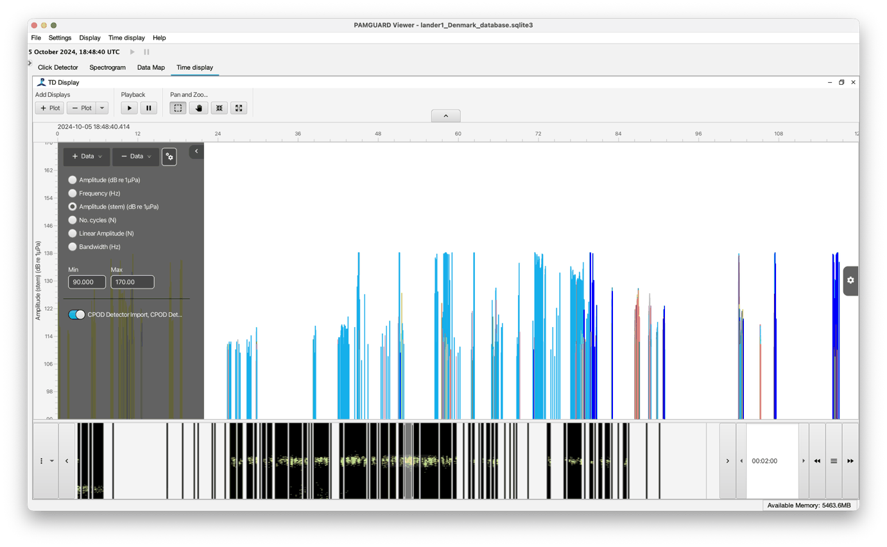{#fig-54}


Finally, visualisation can be easier with a grey background so click on the cogs at the top of the left-hand pane and select a darker background colour.

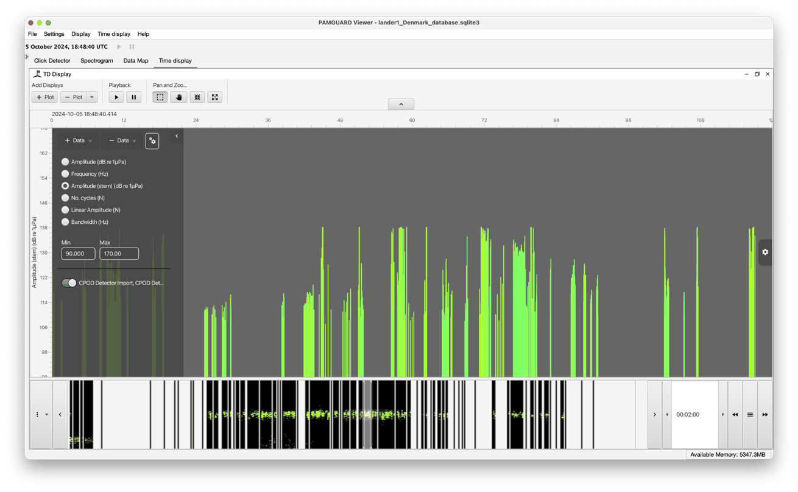{#fig-55 width="654"}


Have a go visualising the CPOD data in other ways -- for example try plotting as Linear Amplitude and Frequency.

Next, we want to compare CPOD data to click data. To do this, we will add another panel to the graph by clicking the ***+*Plot** button at the top of the time display. This will add a new plot. Click ***+Data*** and add ***Click Detector, Clicks.*** You may need to move to a new section of data to

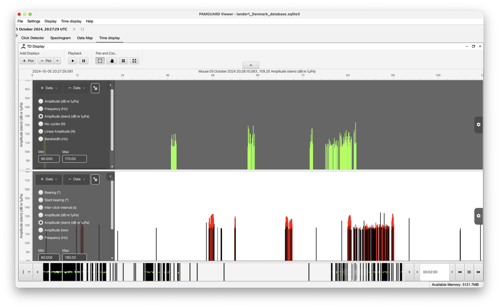
